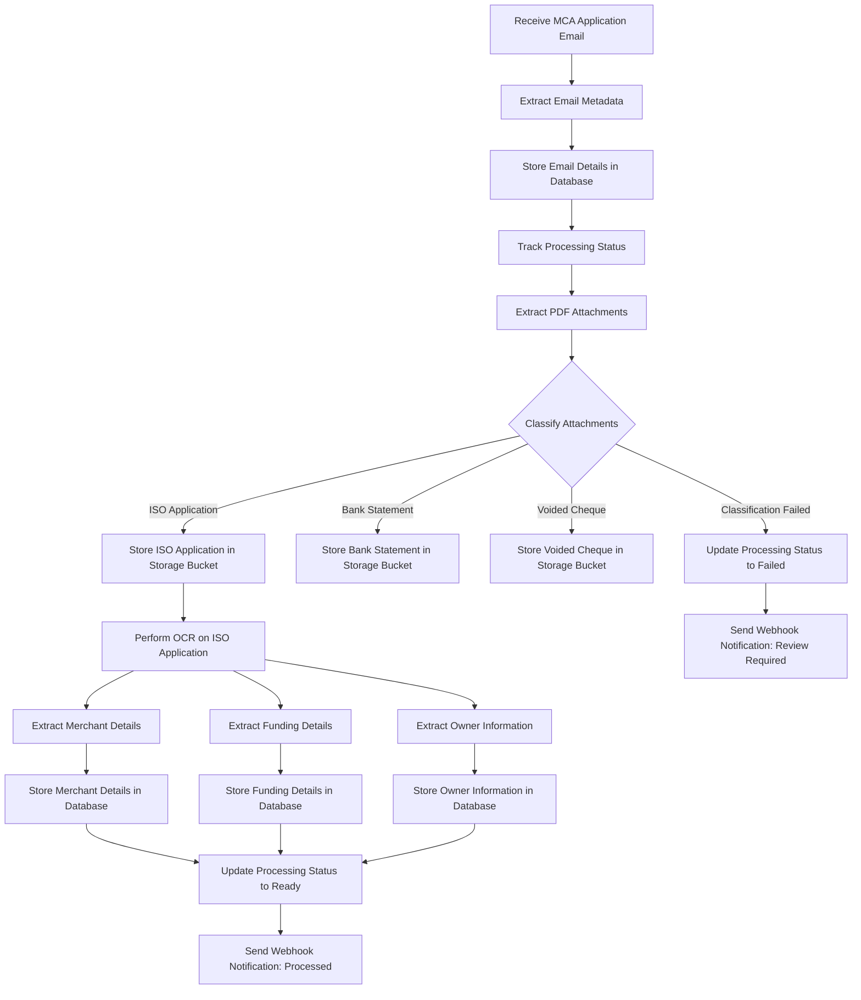
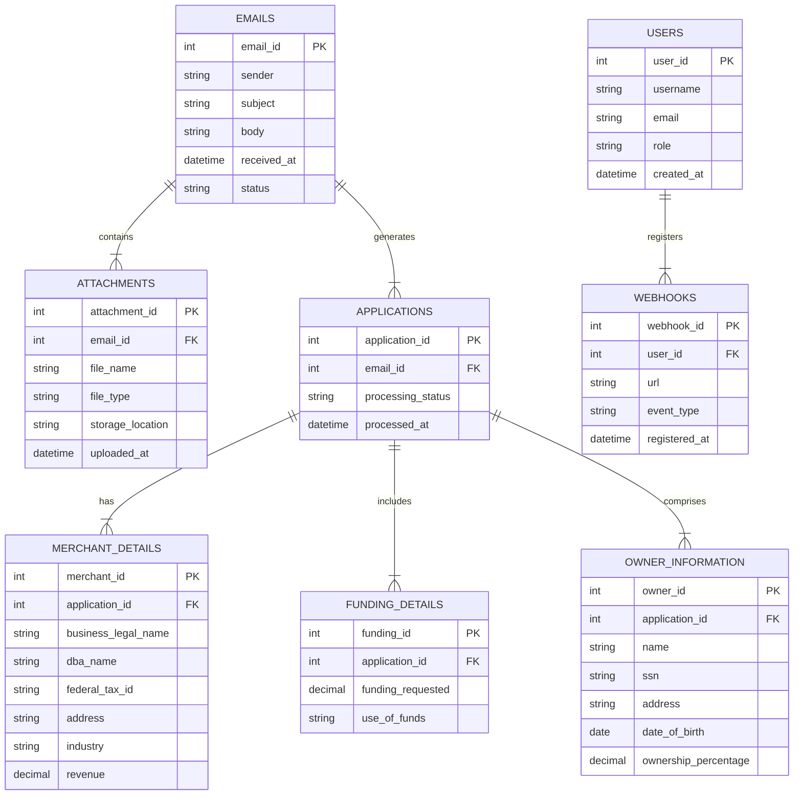

# INTRODUCTION

## PURPOSE

The purpose of this Software Requirements Specification (SRS) document is to outline the detailed requirements for the development of a cloud-based solution designed to digitize Merchant Cash Advance (MCA) applications for Dollar Funding. This document serves as a comprehensive guide for developers, project managers, stakeholders, and quality assurance teams to ensure a clear understanding of the system's functionalities, performance criteria, and design constraints. It aims to facilitate effective communication among all parties involved and provide a foundation for the successful implementation, testing, and maintenance of the software product.

## SCOPE

The software product is a robust, scalable, and highly available cloud-based platform that automates the processing of MCA applications submitted by brokers via email. The primary goals of the system are to:

- **Automate Data Entry:** Eliminate the need for manual data entry by replacing Dollar Funding's current 28-member human data entry team with an automated solution.
- **Efficient Email Processing:** Receive and handle MCA application emails sent to "submissions@dollarfunding.com," extracting metadata and tracking the status of each application.
- **Attachment Management:** Extract, classify, and securely store PDF attachments, including ISO applications, bank statements, and voided cheques, in a designated storage bucket.
- **Advanced OCR Capabilities:** Utilize state-of-the-art Optical Character Recognition (OCR) technology to accurately extract text from ISO applications, even those with handwritten or poorly scanned documents.
- **Data Extraction and Storage:** Identify and extract critical information such as merchant details, funding requests, owner information, and save this data in a structured database.
- **Notification System:** Implement a webhook-based notification system to alert the client about the processing status of applications or any issues that require review.
- **User Interface and API:** Provide both an API and a user-friendly interface for clients to register, manage webhooks, download applications, and view processed information and attachments.
- **Security and Accessibility:** Ensure that all data storage and access mechanisms comply with security best practices, allowing only authorized clients to access sensitive information.

By delivering these core functionalities, the solution aims to enhance operational efficiency, reduce processing time, minimize errors, and provide Dollar Funding with a seamless and reliable platform for managing MCA applications.

# PRODUCT DESCRIPTION

## PRODUCT PERSPECTIVE

The cloud-based solution for digitizing Merchant Cash Advance (MCA) applications is an integral component of Dollar Funding's operational infrastructure. It interfaces with the existing email system to receive MCA applications from brokers and integrates with Dollar Funding's database and storage solutions. The system leverages advanced OCR technology for data extraction and employs secure storage mechanisms to manage sensitive information. It exposes APIs and provides a user-friendly interface for clients to interact with the processed data. The solution is designed to replace the manual data entry process, integrating seamlessly with Dollar Funding's existing workflows to enhance efficiency and scalability.

## PRODUCT FUNCTIONS

- **Email Reception and Metadata Extraction**
  - Automatically receive emails sent to "submissions@dollarfunding.com."
  - Extract metadata such as sender information, email body, and subject line.
  - Store email details in a centralized database and track the processing status.

- **Attachment Processing and Classification**
  - Extract PDF attachments from received emails.
  - Classify attachments into categories: ISO Application, Bank Statement, Voided Cheque.
  - Securely store classified attachments in designated storage buckets accessible to authorized clients.

- **Optical Character Recognition (OCR) and Data Extraction**
  - Employ state-of-the-art OCR to extract text from ISO applications, including handwritten or poorly scanned documents.
  - Identify and extract critical data fields:
    - **Merchant Details:** Business legal name, DBA name, Federal Tax ID or EIN, Address, Industry, Revenue.
    - **Funding Details:** Funding requested, Use of funds.
    - **Owner Information:** Name, SSN, Address, Date of Birth, Ownership percentage.

- **Data Storage and Management**
  - Store extracted data in a structured and secure database.
  - Ensure data integrity and accessibility for authorized users.

- **Notification System**
  - Implement a webhook-based system to notify clients about application processing status.
  - Alert clients in case of processing failures or missing critical information such as SSN or Federal Tax ID.

- **User Interface and API Provisioning**
  - Provide an API for clients to download applications, manage webhooks, and access processed data.
  - Develop a user-friendly web interface to display application information, attachments, and manage webhook registrations.

- **Security and Compliance**
  - Ensure all data storage and access comply with industry security standards.
  - Implement authentication and authorization mechanisms to restrict data access to authorized personnel only.

## USER CHARACTERISTICS

- **Primary Users:**
  - **Dollar Funding Internal Staff:**
    - Roles include data analysts, IT staff, and management personnel.
    - Expertise: Moderate to high technical proficiency, familiar with data management and system interfaces.
  
  - **External Clients (Brokers):**
    - Entities that submit MCA applications via email.
    - Expertise: Basic to intermediate technical skills for interacting with APIs and web interfaces.

- **User Personas:**
  - **Data Analyst Dana:**
    - Responsible for monitoring processed applications and ensuring data accuracy.
    - Requires access to detailed application information and status tracking.
  
  - **IT Manager Mike:**
    - Oversees the integration and maintenance of the system.
    - Needs to manage webhook configurations and troubleshoot any technical issues.
  
  - **Broker Ben:**
    - Submits MCA applications and needs to track submission status.
    - Requires a straightforward interface to view processed applications and receive notifications.

## CONSTRAINTS

- **Regulatory Compliance:**
  - Must comply with data protection regulations such as GDPR and CCPA.
  - Ensure secure handling of sensitive information like SSN and Federal Tax IDs.

- **Technical Constraints:**
  - Dependence on the reliability of email systems for application submissions.
  - OCR accuracy must meet predefined thresholds to minimize data extraction errors.

- **Performance Requirements:**
  - The system must handle high volumes of emails and attachments without significant latency.
  - Ensure high availability with minimal downtime to support continuous operations.

- **Budgetary Limitations:**
  - Development and maintenance must stay within allocated budget constraints.
  - Optimize resource usage to prevent cost overruns, especially concerning cloud storage and processing.

## ASSUMPTIONS AND DEPENDENCIES

- **Assumptions:**
  - Brokers will continue to submit MCA applications via the designated email address.
  - PDF attachments will adhere to standard formats that are compatible with the OCR technology used.
  - Clients have the necessary infrastructure to integrate with the provided APIs and web interfaces.

- **Dependencies:**
  - Relies on third-party OCR services for text extraction capabilities.
  - Dependent on cloud service providers for storage and processing infrastructure.
  - Requires stable internet connectivity for real-time email processing and webhook notifications.
  - Integration with existing Dollar Funding databases and authentication systems.

# PROCESS FLOWCHART

# FUNCTIONAL REQUIREMENTS

## FR1: Email Reception and Metadata Extraction

### ID
FR1

### Description
This feature handles the automatic reception of MCA application emails sent to "submissions@dollarfunding.com". It extracts essential metadata from each email, including sender information, email body, and subject line, and stores these details in a centralized database. Additionally, it tracks the processing status of each email to monitor the workflow.

### Priority
High

### Functional Requirements

| FR ID | Description | Input | Output | Related |
|-------|-------------|-------|--------|---------|
| FR1.1 | Receive incoming emails sent to "submissions@dollarfunding.com". | Incoming email | Email data captured for processing | FR1.2, FR1.3 |
| FR1.2 | Extract metadata from received emails, including sender, subject, and body. | Email data | Extracted metadata | FR1.1, FR1.3 |
| FR1.3 | Store extracted email metadata in the centralized database. | Extracted metadata | Metadata stored in database | FR1.1, FR1.2 |
| FR1.4 | Track and update the processing status of each received email. | Email ID | Status updates (Processing, Ready, Failed) | FR1.1, FR1.3 |

## FR2: Attachment Processing and Classification

### ID
FR2

### Description
This feature manages the extraction of PDF attachments from received emails. It classifies each attachment into predefined categories—ISO Application, Bank Statement, or Voided Cheque—and securely stores them in designated storage buckets accessible to authorized clients.

### Priority
High

### Functional Requirements

| FR ID | Description | Input | Output | Related |
|-------|-------------|-------|--------|---------|
| FR2.1 | Extract PDF attachments from received emails. | Received email with attachments | Isolated PDF files | FR2.2 |
| FR2.2 | Classify extracted PDFs into ISO Application, Bank Statement, or Voided Cheque. | PDF attachments | Categorized attachments | FR2.1, FR2.3 |
| FR2.3 | Store classified attachments in secure storage buckets. | Categorized PDFs | PDFs stored in respective buckets | FR2.2 |
| FR2.4 | Ensure secure access to stored attachments for authorized clients. | Stored PDFs | Access permissions enforced | FR2.3 |

## FR3: Optical Character Recognition (OCR) and Data Extraction

### ID
FR3

### Description
This feature utilizes advanced OCR technology to extract text from ISO applications, including those that are handwritten or poorly scanned. It identifies and extracts critical data fields such as merchant details, funding requests, and owner information, storing this data in a structured database.

### Priority
High

### Functional Requirements

| FR ID | Description | Input | Output | Related |
|-------|-------------|-------|--------|---------|
| FR3.1 | Perform OCR on ISO Application PDFs to extract text data. | ISO Application PDF | Extracted text | FR3.2, FR3.3 |
| FR3.2 | Identify and extract Merchant Details from OCR text. | Extracted text | Merchant details (Business name, EIN, etc.) | FR3.1 |
| FR3.3 | Identify and extract Funding Details from OCR text. | Extracted text | Funding requested, Use of funds | FR3.1 |
| FR3.4 | Identify and extract Owner Information from OCR text. | Extracted text | Owner details (Name, SSN, etc.) | FR3.1 |
| FR3.5 | Store extracted data fields in the structured database. | Extracted data | Data entries in database | FR3.2, FR3.3, FR3.4 |

## FR4: Data Storage and Management

### ID
FR4

### Description
This feature ensures that all extracted data is stored securely and structured within a centralized database. It maintains data integrity and provides accessibility to authorized users for further processing and review.

### Priority
High

### Functional Requirements

| FR ID | Description | Input | Output | Related |
|-------|-------------|-------|--------|---------|
| FR4.1 | Store merchant, funding, and owner details in the database. | Extracted data from FR3 | Structured data entries | FR3.5 |
| FR4.2 | Maintain data integrity through validation and error-checking mechanisms. | Data inputs | Validated and error-free data | FR4.1 |
| FR4.3 | Provide secure access to stored data for authorized users. | User requests | Data retrieval with access control | FR4.1 |
| FR4.4 | Enable data retrieval and management through APIs and UI. | API calls/UI interactions | Requested data displayed or provided | FR4.3 |

## FR5: Notification System

### ID
FR5

### Description
This feature implements a webhook-based notification system to inform clients about the processing status of MCA applications. It sends alerts upon successful processing or notifies clients when issues arise, such as processing failures or missing critical information.

### Priority
Medium

### Functional Requirements

| FR ID | Description | Input | Output | Related |
|-------|-------------|-------|--------|---------|
| FR5.1 | Configure webhook endpoints for client notifications. | Client webhook URLs | Webhook configurations stored | FR5.2 |
| FR5.2 | Send notifications upon successful processing of applications. | Processing status | Webhook alerts sent to clients | FR5.1 |
| FR5.3 | Notify clients of processing failures or missing critical information. | Error detections | Failure notifications sent to clients | FR5.1 |
| FR5.4 | Allow clients to manage webhook configurations via API and UI. | Client requests | Webhook endpoints added/edited/removed | FR5.1 |

## FR6: User Interface and API Provisioning

### ID
FR6

### Description
This feature provides both an API and a user-friendly web interface for clients to interact with the system. Clients can register and manage webhooks, download applications, view processed information, and access attachments through these interfaces.

### Priority
High

### Functional Requirements

| FR ID | Description | Input | Output | Related |
|-------|-------------|-------|--------|---------|
| FR6.1 | Develop APIs for clients to download applications and access processed data. | API requests | Data and attachments provided via API | FR6.2 |
| FR6.2 | Create a user-friendly web interface for managing webhooks and viewing application information. | User interactions | Web interface displays and allows management | FR6.1 |
| FR6.3 | Enable clients to register, add, edit, and remove webhooks through the interface. | Client actions | Webhook configurations updated | FR5.4 |
| FR6.4 | Display processed application details and attachments in the web interface. | Processed data | Detailed views of applications and attachments | FR4.4 |
| FR6.5 | Ensure API and UI provide secure authentication and authorization mechanisms. | User credentials | Access granted based on permissions | FR6.1, FR6.2 |

## FR7: Security and Compliance

### ID
FR7

### Description
This feature ensures that all data storage and access mechanisms comply with industry security standards and data protection regulations. It implements robust authentication and authorization controls to restrict access to sensitive information, safeguarding against unauthorized access and data breaches.

### Priority
High

### Functional Requirements

| FR ID | Description | Input | Output | Related |
|-------|-------------|-------|--------|---------|
| FR7.1 | Implement authentication mechanisms for all user access points. | User credentials | Verified user identities | FR7.2 |
| FR7.2 | Establish authorization controls to restrict data access based on user roles. | User roles and permissions | Access rights enforced | FR7.1 |
| FR7.3 | Encrypt sensitive data both at rest and in transit. | Data storage and transmission | Encrypted data | FR4.1, FR6.1 |
| FR7.4 | Ensure compliance with GDPR, CCPA, and other relevant data protection regulations. | Data handling processes | Compliance reports and audits | FR7.1, FR7.2, FR7.3 |
| FR7.5 | Monitor and log all access and data transactions for security auditing. | User actions | Access logs and audit trails | FR7.1, FR7.2 |

## FR8: System Performance and Scalability

### ID
FR8

### Description
This feature ensures that the system can handle high volumes of emails and attachments efficiently, maintaining minimal latency and high availability. It supports scalability to accommodate growing data loads and ensures continuous operations with minimal downtime.

### Priority
Medium

### Functional Requirements

| FR ID | Description | Input | Output | Related |
|-------|-------------|-------|--------|---------|
| FR8.1 | Design the system architecture to support horizontal and vertical scaling. | System load metrics | Scalable infrastructure | FR8.2 |
| FR8.2 | Implement load balancing to distribute processing tasks effectively. | Incoming processing requests | Balanced load across servers | FR8.1 |
| FR8.3 | Optimize OCR and data extraction processes to meet performance thresholds. | Processing tasks | Efficient and accurate data extraction | FR3 |
| FR8.4 | Ensure high availability with redundant systems and failover mechanisms. | System components | Minimization of downtime | FR8.1, FR8.2 |
| FR8.5 | Monitor system performance and automatically scale resources as needed. | Performance metrics | Adjusted resource allocation | FR8.1, FR8.3 |

## FR9: Error Handling and Recovery

### ID
FR9

### Description
This feature manages the detection, reporting, and recovery from errors that occur during the processing of MCA applications. It ensures that any failures are promptly addressed and that the system can recover gracefully without data loss.

### Priority
Medium

### Functional Requirements

| FR ID | Description | Input | Output | Related |
|-------|-------------|-------|--------|---------|
| FR9.1 | Detect errors during email reception, attachment processing, OCR, and data storage. | Processing logs | Error alerts | FR9.2 |
| FR9.2 | Log detailed information about encountered errors for troubleshooting. | Error events | Error logs | FR9.1 |
| FR9.3 | Notify clients of critical errors that require manual intervention. | Critical error detection | Error notifications via webhook | FR5.3 |
| FR9.4 | Implement retry mechanisms for transient errors during processing. | Temporary failures | Retried processing tasks | FR9.1 |
| FR9.5 | Provide administrative tools for monitoring and managing system errors. | Admin access | Error management interface | FR9.3 |

## FR10: Data Analytics and Reporting

### ID
FR10

### Description
This feature offers data analytics and reporting capabilities to provide insights into the processing of MCA applications. It enables stakeholders to generate reports on various metrics, monitor system performance, and make informed decisions based on the analyzed data.

### Priority
Low

### Functional Requirements

| FR ID | Description | Input | Output | Related |
|-------|-------------|-------|--------|---------|
| FR10.1 | Collect and aggregate data on processed applications and system performance. | Processed data and logs | Aggregated datasets | FR10.2 |
| FR10.2 | Provide a reporting interface for generating customizable reports. | User-selected metrics | Generated reports | FR10.1 |
| FR10.3 | Enable data visualization through charts and graphs in the UI. | Aggregated data | Visual representations | FR10.2 |
| FR10.4 | Allow export of reports in various formats (e.g., PDF, CSV). | Generated reports | Exported report files | FR10.2 |
| FR10.5 | Schedule automated report generation and distribution to stakeholders. | Reporting schedules | Timely report deliveries | FR10.2 |

# NON-FUNCTIONAL REQUIREMENTS

## PERFORMANCE

### Description
The system must meet specific performance criteria to ensure efficient processing of MCA applications. These criteria include response times, system throughput, and optimal resource utilization to handle expected workloads without degradation of service.

### Requirements

| Performance Metric      | Description                                              | Target Value                        |
|-------------------------|----------------------------------------------------------|-------------------------------------|
| Response Time           | Time taken to acknowledge and start processing an email   | ≤ 2 seconds                          |
| Throughput              | Number of emails processed per hour                      | Minimum 10,000 emails/hour           |
| OCR Processing Time     | Time taken to perform OCR on each ISO application         | ≤ 5 seconds per document             |
| Data Extraction Speed   | Time taken to extract and store data from OCR results     | ≤ 3 seconds per application          |
| System Latency          | End-to-end latency from email receipt to notification     | ≤ 10 seconds                         |
| Resource Utilization    | CPU and memory usage during peak processing               | CPU: ≤ 70%, Memory: ≤ 80%              |
| Scalability             | Ability to scale horizontally to handle increased load     | Support up to 100,000 emails/day      |
| Availability            | System uptime to ensure continuous operation              | ≥ 99.9% uptime                       |

## SAFETY

### Description
Safety requirements ensure the protection of user data and the system's ability to handle failures gracefully without causing data loss or corruption. This includes mechanisms for backup, disaster recovery, and safe data handling practices.

### Requirements

| Safety Requirement          | Description                                                  | Compliance                |
|-----------------------------|--------------------------------------------------------------|---------------------------|
| Data Backup                 | Regular backups of all critical data to prevent loss         | Daily backups with offsite storage |
| Disaster Recovery Plan      | Comprehensive plan to restore system functionality after a disaster | Recovery within 4 hours     |
| Data Integrity              | Ensure data remains accurate and consistent during processing | Implement checksums and validation routines |
| Redundancy                  | Redundant system components to prevent single points of failure | Dual servers and failover mechanisms |
| Safe Data Handling          | Procedures to handle data safely during processing and storage | Adherence to best practices for data management |
| Fault Tolerance             | System's ability to continue operating despite failures      | Automatic failover and error handling |

## SECURITY

### Description
Security requirements focus on protecting the system and its data from unauthorized access, ensuring data privacy, and maintaining the integrity and confidentiality of sensitive information. This includes authentication, authorization, encryption, and regular security audits.

### Requirements

| Security Feature           | Description                                                  | Implementation Details                           |
|----------------------------|--------------------------------------------------------------|-------------------------------------------------|
| Authentication             | Verify the identity of users accessing the system            | Use OAuth 2.0 and multi-factor authentication   |
| Authorization              | Restrict access based on user roles and permissions          | Role-Based Access Control (RBAC)                |
| Data Encryption at Rest    | Encrypt all stored data to protect against unauthorized access | AES-256 encryption standard                     |
| Data Encryption in Transit | Encrypt data during transmission to prevent eavesdropping    | TLS 1.2 or higher                                |
| Privacy Controls           | Ensure user data is handled in compliance with privacy laws  | Implement data masking and anonymization where necessary |
| Security Audits            | Regularly assess the system for vulnerabilities             | Quarterly security assessments and penetration testing |
| Intrusion Detection        | Monitor for and detect unauthorized access attempts          | Deploy IDS/IPS systems and real-time monitoring |
| Secure API Access          | Protect APIs from unauthorized use and abuse                 | Use API keys, rate limiting, and IP whitelisting |

## QUALITY

### Description
Quality requirements encompass various attributes that determine the overall excellence of the system. This includes availability, maintainability, usability, scalability, and reliability to ensure the system meets user expectations and operational standards.

### Requirements

| Quality Attribute    | Description                                                  | Target Standards                             |
|----------------------|--------------------------------------------------------------|----------------------------------------------|
| Availability         | System is operational and accessible when required           | ≥ 99.9% uptime                               |
| Maintainability      | Ease of updating and maintaining the system                  | Modular architecture with clear documentation |
| Usability            | User interface is intuitive and easy to navigate             | User satisfaction score ≥ 90%                |
| Scalability          | Ability to handle increased load without performance loss    | Seamless scaling to 100,000 emails/day       |
| Reliability          | System performs consistently without failures                | Mean Time Between Failures (MTBF) ≥ 1,000 hours |
| Performance Efficiency | Optimal use of system resources to achieve desired performance | Efficient CPU and memory usage as per performance metrics |
| Portability          | Ability to deploy the system across different environments    | Cloud-agnostic deployment supporting AWS and Azure |
| Fault Tolerance      | System continues to operate smoothly despite failures        | Automatic failover and error recovery mechanisms |

## COMPLIANCE

### Description
Compliance requirements ensure that the system adheres to all relevant legal, regulatory, and industry standards. This includes data protection laws, financial regulations, and standards related to information security and system development.

### Requirements

| Compliance Area          | Description                                                  | Specific Requirements                                    |
|--------------------------|--------------------------------------------------------------|----------------------------------------------------------|
| Data Protection Laws     | Adherence to regulations governing data privacy and security | GDPR, CCPA compliance for handling personal data         |
| Financial Regulations    | Compliance with financial industry standards                | SOC 2 Type II certification, PCI-DSS if handling payment data |
| Information Security Standards | Follow industry best practices for securing information    | ISO/IEC 27001 certification, NIST guidelines             |
| Accessibility Standards  | Ensure system is accessible to all users                     | WCAG 2.1 Level AA compliance                             |
| Software Development Standards | Adhere to established software development practices      | ISO/IEC 12207 for software lifecycle processes           |
| Audit and Reporting      | Maintain records and reports for regulatory audits          | Implement logging and monitoring in line with compliance reporting requirements |
| Legal Requirements       | Adhere to contractual and legal obligations                  | Ensure all data handling practices comply with client agreements and relevant laws |

# DATA REQUIREMENTS

## DATA MODELS

The data model for the cloud-based solution encompasses several key entities and their relationships to ensure comprehensive data management and integrity.

### Entity-Relationship Diagram

## DATA STORAGE

### Data Storage Architecture

The system leverages a combination of relational and object storage solutions to manage and store data efficiently.

- **Relational Database:** Utilized for structured data entities such as Emails, Applications, Merchant Details, Funding Details, Owner Information, Users, and Webhooks. The database ensures data integrity, supports complex queries, and facilitates relationships between entities.

- **Object Storage (e.g., AWS S3, Azure Blob Storage):** Employed for storing PDF attachments securely. Each attachment is categorized and stored in designated storage buckets based on its type (ISO Application, Bank Statement, Voided Cheque).

### Data Retention

- **Retention Policy:** All data, including emails, attachments, and extracted information, will be retained for a minimum of seven years to comply with financial regulations and company policies.

- **Archiving:** Data older than two years will be archived to cost-effective storage solutions, ensuring accessibility for auditing and reporting purposes.

### Redundancy

- **Database Redundancy:** Implemented through multi-az (availability zone) deployments to ensure high availability and fault tolerance.

- **Storage Redundancy:** Object storage solutions offer built-in redundancy by replicating data across multiple physical locations within a region.

### Backup and Recovery

- **Automated Backups:** Daily automated backups of the relational database with point-in-time recovery capabilities to restore data to any specific moment within the backup retention period.

- **Snapshot Strategy:** Periodic snapshots of storage buckets to safeguard against accidental deletions or data corruption.

- **Disaster Recovery Plan:** Comprehensive strategies to restore system functionality within four hours in the event of a catastrophic failure, utilizing geographically dispersed backup sites.

## DATA PROCESSING

### Data Security

To ensure the security and integrity of data during processing, the following measures are implemented:

- **Data Encryption:** 
  - **At Rest:** All stored data, including database entries and attachments in object storage, are encrypted using AES-256 encryption.
  - **In Transit:** Data transmitted between system components and external clients is secured using TLS 1.2 or higher.

- **Access Control:**
  - **Authentication:** Utilizes OAuth 2.0 with multi-factor authentication (MFA) for verifying user identities.
  - **Authorization:** Role-Based Access Control (RBAC) to restrict access to sensitive data based on user roles and permissions.

- **Data Masking and Anonymization:** Sensitive information such as SSNs and Federal Tax IDs are masked or anonymized in non-production environments to protect privacy.

- **Logging and Monitoring:** Comprehensive logging of all data transactions and access attempts, monitored in real-time for any unauthorized or suspicious activities.

### Data Flow Diagram

# EXTERNAL INTERFACES

## USER INTERFACES

### Web Interface

The system shall provide a user-friendly web interface that allows clients to interact with the platform seamlessly. The interface will include the following features:

- **Dashboard:** Overview of processed applications, system status, and recent activities.
- **Application Management:** View detailed information about each MCA application, including metadata, extracted data, and attachments.
- **Webhook Management:** Register, edit, and remove webhook URLs for receiving notifications.
- **User Account Management:** Manage user profiles, roles, and permissions.
- **Report Access:** Generate and view reports on application processing metrics.

*Placeholder for Web Interface Mockup*

### API Interface

The system shall offer a comprehensive RESTful API that enables clients to programmatically interact with the platform. The API will support the following operations:

- **Authentication:** Secure access using OAuth 2.0 tokens.
- **Application Retrieval:** Download processed applications and access extracted data.
- **Webhook Configuration:** Register, update, and delete webhook endpoints.
- **Data Access:** Query and retrieve specific application details and statuses.
- **Error Handling:** Receive detailed error messages and status codes for troubleshooting.

*Placeholder for API Documentation Mockup*

## SOFTWARE INTERFACES

### Email System Integration

- **Protocol:** The system will integrate with the client's existing email server using IMAP for receiving emails sent to "submissions@dollarfunding.com".
- **Authentication:** Secure authentication using OAuth 2.0 or other supported authentication mechanisms.
- **Interaction:** Automatically fetch and process incoming emails, handling attachments as per functional requirements.

### Optical Character Recognition (OCR) Service

- **Provider:** Integration with a third-party OCR provider that supports advanced text extraction from various document qualities.
- **API Endpoints:** Utilize RESTful APIs to send PDF documents for text extraction and receive processed data.
- **Authentication:** Secure API access using API keys or OAuth 2.0 tokens.
- **Data Handling:** Ensure compliance with data privacy standards during data transmission and processing.

### Cloud Storage Services

- **Provider:** Integration with AWS S3 or Azure Blob Storage for storing PDF attachments and other related files.
- **API Endpoints:** Use the respective cloud provider's APIs for uploading, retrieving, and managing storage buckets.
- **Authentication:** Secure access using IAM roles, access keys, or other cloud-specific authentication methods.
- **Data Organization:** Store attachments in categorized storage buckets based on attachment type (ISO Application, Bank Statement, Voided Cheque).

### Database Systems

- **Relational Database:** Interaction with the existing relational database management system (RDBMS) used by Dollar Funding.
- **API Endpoints:** Use SQL queries and stored procedures to manage data storage and retrieval.
- **Authentication:** Secure database connections using credentials managed through a secrets management system.
- **Data Integrity:** Ensure ACID compliance for all transactions to maintain data integrity.

### Authentication and Authorization Systems

- **OAuth 2.0:** Implement OAuth 2.0 for securing API endpoints and managing user sessions.
- **Role-Based Access Control (RBAC):** Interface with existing RBAC systems to enforce access permissions based on user roles.
- **Multi-Factor Authentication (MFA):** Integrate MFA processes to enhance security for user logins and critical operations.

## COMMUNICATION INTERFACES

### Communication Protocols

- **HTTPS:** All interactions between clients and the system, including API calls and web interface access, will occur over HTTPS to ensure data encryption in transit.
- **RESTful APIs:** The system's APIs will follow REST architectural principles, using standard HTTP methods (GET, POST, PUT, DELETE) for resource manipulation.
- **Webhooks:** Clients can register webhook URLs to receive real-time notifications about application processing statuses via HTTP POST requests.

### Data Formats

- **JSON:** The primary data interchange format for APIs and webhooks will be JSON, ensuring compatibility and ease of parsing across different platforms.
- **XML:** Support for XML formatted data can be provided if required by specific client integrations.

### Interaction Methods

- **API Authentication:** Secure API access through OAuth 2.0 tokens, ensuring that only authorized clients can perform operations.
- **Webhook Delivery:** Use HTTP POST requests to deliver webhook notifications to registered client endpoints. Ensure payloads are signed or include verification tokens to authenticate the source.
- **Error Reporting:** APIs and webhooks will include detailed error messages and standardized HTTP status codes to facilitate client-side error handling and troubleshooting.

### Data Transfer

- **Large File Handling:** Implement mechanisms for handling large PDF attachments efficiently, including multipart uploads and resumable downloads.
- **Rate Limiting:** Enforce rate limits on API endpoints to prevent abuse and ensure fair usage among clients.
- **Retry Mechanisms:** Incorporate retry logic for transient communication failures, especially for webhook deliveries and API requests.

---

# APPENDICES

## GLOSSARY

| Term                     | Definition                                                                                      |
|--------------------------|-------------------------------------------------------------------------------------------------|
| MCA                      | Merchant Cash Advance, a type of financing provided to businesses based on future credit card sales. |
| OCR                      | Optical Character Recognition, technology used to convert different types of documents into editable and searchable data. |
| API                      | Application Programming Interface, a set of rules that allows different software entities to communicate with each other. |
| UI                       | User Interface, the means by which the user interacts with the system.                           |
| Webhook                  | A method for one application to provide real-time information to other applications.             |
| ISO Application          | A standardized application form used for processing MCA requests.                               |
| GDPR                     | General Data Protection Regulation, a regulation in EU law on data protection and privacy.      |
| CCPA                     | California Consumer Privacy Act, a state statute intended to enhance privacy rights and consumer protection for residents of California, USA. |
| AES-256                  | Advanced Encryption Standard with a 256-bit key, a widely used encryption algorithm.             |
| TLS                      | Transport Layer Security, a cryptographic protocol designed to provide secure communication over a computer network. |
| IMAP                     | Internet Message Access Protocol, a standard email protocol that stores email messages on a mail server. |
| AWS S3                   | Amazon Web Services Simple Storage Service, a scalable storage solution provided by AWS.         |
| Azure Blob Storage       | Microsoft's Object Storage solution for the cloud, offering storage for large amounts of unstructured data. |
| OAuth 2.0                | An open standard for access delegation, commonly used for token-based authentication and authorization on the internet. |
| RBAC                     | Role-Based Access Control, a method of regulating access to computer or network resources based on the roles of individual users. |
| IDS/IPS                  | Intrusion Detection System/Intrusion Prevention System, technologies used to detect and prevent unauthorized access to networks. |
| SOC 2 Type II            | Service Organization Control 2 Type II, an auditing procedure that ensures service providers securely manage data to protect the interests of the organization and its customers. |
| PCI-DSS                  | Payment Card Industry Data Security Standard, a set of security standards designed to ensure that all companies that accept, process, store or transmit credit card information maintain a secure environment. |
| WCAG                     | Web Content Accessibility Guidelines, a set of guidelines for making web content more accessible to people with disabilities. |
| MTBF                     | Mean Time Between Failures, a measure of how reliable a hardware product or component is.        |

## ACRONYMS

| Acronym | Expanded Form                        |
|---------|---------------------------------------|
| MCA     | Merchant Cash Advance                 |
| OCR     | Optical Character Recognition         |
| API     | Application Programming Interface     |
| UI      | User Interface                        |
| GDPR    | General Data Protection Regulation    |
| CCPA    | California Consumer Privacy Act       |
| AES     | Advanced Encryption Standard          |
| TLS     | Transport Layer Security              |
| IMAP    | Internet Message Access Protocol      |
| AWS     | Amazon Web Services                   |
| RBAC    | Role-Based Access Control             |
| IDS     | Intrusion Detection System            |
| IPS     | Intrusion Prevention System           |
| SOC     | Service Organization Control          |
| PCI-DSS | Payment Card Industry Data Security Standard |
| WCAG    | Web Content Accessibility Guidelines  |
| MTBF    | Mean Time Between Failures            |

## ADDITIONAL REFERENCES

- **General Data Protection Regulation (GDPR):** [https://gdpr.eu/](https://gdpr.eu/)
- **California Consumer Privacy Act (CCPA):** [https://oag.ca.gov/privacy/ccpa](https://oag.ca.gov/privacy/ccpa)
- **ISO/IEC 27001 Information Security Management:** [https://www.iso.org/isoiec-27001-information-security.html](https://www.iso.org/isoiec-27001-information-security.html)
- **National Institute of Standards and Technology (NIST) Guidelines:** [https://www.nist.gov/](https://www.nist.gov/)
- **Payment Card Industry Data Security Standard (PCI-DSS):** [https://www.pcisecuritystandards.org/](https://www.pcisecuritystandards.org/)
- **Web Content Accessibility Guidelines (WCAG) 2.1:** [https://www.w3.org/TR/WCAG21/](https://www.w3.org/TR/WCAG21/)
- **OAuth 2.0 Specifications:** [https://oauth.net/2/](https://oauth.net/2/)
- **Amazon Web Services (AWS) S3 Documentation:** [https://docs.aws.amazon.com/s3/](https://docs.aws.amazon.com/s3/)
- **Azure Blob Storage Documentation:** [https://docs.microsoft.com/en-us/azure/storage/blobs/](https://docs.microsoft.com/en-us/azure/storage/blobs/)
- **Intrusion Detection System (IDS) Overview:** [https://www.cisco.com/c/en/us/products/security/intrusion-detection-system-ids/index.html](https://www.cisco.com/c/en/us/products/security/intrusion-detection-system-ids/index.html)
- **OAuth 2.0 and OpenID Connect:** [https://openid.net/connect/](https://openid.net/connect/)