# INTRODUCTION

## PURPOSE

The purpose of this Software Requirements Specification (SRS) document is to outline the detailed requirements for the development of a cloud-based solution designed to digitize Merchant Cash Advance (MCA) applications for Dollar Funding. This document serves as a comprehensive guide for developers, project managers, stakeholders, and quality assurance teams to ensure a clear understanding of the system's functionalities, performance criteria, and design constraints. It aims to facilitate effective communication among all parties involved and provide a foundation for the successful implementation, testing, and maintenance of the software product.

## SYSTEM OBJECTIVES

The primary objectives of the cloud-based solution for Dollar Funding are as follows:

- **Automate Manual Processes:** Replace the existing 28-member human data entry team by automating the intake and processing of MCA applications, thereby reducing labor costs and minimizing human error.
  
- **Enhance Data Accuracy and Integrity:** Utilize advanced OCR technology to accurately extract and validate critical information from MCA applications, ensuring high data quality and consistency.
  
- **Improve Operational Efficiency:** Streamline the workflow from email reception to data storage and notification, reducing the overall processing time for each application.
  
- **Ensure Scalability and Reliability:** Design a system architecture that can scale horizontally and vertically to handle increasing volumes of applications while maintaining high availability and minimal downtime.
  
- **Provide Secure Data Management:** Implement robust security measures to protect sensitive information, comply with data protection regulations, and ensure authorized access to data and system functionalities.
  
- **Facilitate Real-Time Notifications:** Enable timely communication with clients through webhook-based notifications, keeping them informed about the processing status of applications and any issues that require attention.
  
- **Offer Comprehensive User Interfaces:** Develop both API and web-based interfaces that are user-friendly and provide clients with the tools needed to manage webhooks, download applications, and view processed data efficiently.
  
- **Support Data Analytics and Reporting:** Incorporate analytics and reporting capabilities to provide insights into system performance, application processing metrics, and operational trends, aiding in informed decision-making.

## SCOPE

The software product is a robust, scalable, and highly available cloud-based platform that automates the processing of MCA applications submitted by brokers via email. The primary goals of the system are to:

- **Automate Data Entry:** Eliminate the need for manual data entry by replacing Dollar Funding's current 28-member human data entry team with an automated solution.
  
- **Efficient Email Processing:** Receive and handle MCA application emails sent to "submissions@dollarfunding.com," extracting metadata and tracking the status of each application.
  
- **Attachment Management:** Extract, classify, and securely store PDF attachments, including ISO applications, bank statements, and voided cheques, in a designated storage bucket.
  
- **Advanced OCR Capabilities:** Utilize state-of-the-art Optical Character Recognition (OCR) technology to accurately extract text from ISO applications, even those with handwritten or poorly scanned documents.
  
- **Data Extraction and Storage:** Identify and extract critical information such as merchant details, funding requests, owner information, and save this data in a structured database.
  
- **Notification System:** Implement a webhook-based notification system to alert the client about the processing status of applications or any issues that require review.
  
- **User Interface and API:** Provide both an API and a user-friendly interface for clients to register, manage webhooks, download applications, and view processed information and attachments.
  
- **Security and Accessibility:** Ensure that all data storage and access mechanisms comply with security best practices, allowing only authorized clients to access sensitive information.

By delivering these core functionalities, the solution aims to enhance operational efficiency, reduce processing time, minimize errors, and provide Dollar Funding with a seamless and reliable platform for managing MCA applications.

# TECHNICAL REQUIREMENTS

## TR1: System Architecture

### ID
TR1

### Description
Defines the overall architecture of the cloud-based solution, ensuring scalability, reliability, and efficient integration with existing systems. The architecture should support modular components, facilitate easy maintenance, and enable seamless deployment across different environments.

### Priority
High

### Technical Requirements

| TR ID | Description | Implementation Details | Related |
|-------|-------------|------------------------|---------|
| TR1.1 | Adopt a microservices architecture to ensure modularity and scalability. | Use containerization technologies such as Docker and orchestration tools like Kubernetes. | TR1.2, TR1.3 |
| TR1.2 | Ensure horizontal and vertical scalability to handle varying loads. | Implement auto-scaling groups in the cloud infrastructure. | TR1.1 |
| TR1.3 | Utilize a serverless framework for specific components to optimize resource usage. | Use AWS Lambda or Azure Functions for event-driven tasks. | TR1.1, TR1.2 |
| TR1.4 | Implement a service mesh for secure and efficient inter-service communication. | Use Istio or Linkerd for traffic management and security policies. | TR1.1, TR1.5 |
| TR1.5 | Ensure high availability with multi-region deployments. | Deploy services across multiple availability zones and regions. | TR1.1, TR1.2 |
| TR1.6 | Facilitate continuous integration and continuous deployment (CI/CD). | Use tools like Jenkins, GitHub Actions, or Azure DevOps for automated pipelines. | TR1.7 |

## TR2: Technology Stack

### ID
TR2

### Description
Specifies the technologies, programming languages, frameworks, and tools used in the development and deployment of the cloud-based solution. Ensures consistency, maintainability, and efficiency across all components.

### Priority
High

### Technical Requirements

| TR ID | Description | Implementation Details | Related |
|-------|-------------|------------------------|---------|
| TR2.1 | Backend Development | Use Node.js with Express.js framework for building RESTful APIs. | TR2.2, TR2.3 |
| TR2.2 | Frontend Development | Develop the web interface using React.js for a responsive and interactive UI. | TR2.1, TR2.4 |
| TR2.3 | Database Management | Utilize PostgreSQL for the relational database needs, ensuring ACID compliance. | TR2.1, TR2.5 |
| TR2.4 | API Integration | Implement Swagger for API documentation and testing. | TR2.2, TR2.6 |
| TR2.5 | Object Storage | Use AWS S3 or Azure Blob Storage for storing PDF attachments securely. | TR2.3 |
| TR2.6 | Authentication and Authorization | Implement OAuth 2.0 and JWT for secure access to APIs and services. | TR2.1, TR2.4 |

## TR3: Data Processing Pipeline

### ID
TR3

### Description
Defines the workflow and technical processes for handling MCA application data from email reception to data extraction and storage. Ensures efficient and accurate processing of large volumes of data with minimal latency.

### Priority
High

### Technical Requirements

| TR ID | Description | Implementation Details | Related |
|-------|-------------|------------------------|---------|
| TR3.1 | Email Ingestion | Use AWS SES or equivalent to receive and process incoming emails. | TR3.2 |
| TR3.2 | Message Queueing | Implement RabbitMQ or AWS SQS for managing processing queues. | TR3.1, TR3.3 |
| TR3.3 | Attachment Extraction | Use libraries like Apache PDFBox for extracting and handling PDF attachments. | TR3.2 |
| TR3.4 | OCR Integration | Integrate with Tesseract OCR or a third-party OCR service for text extraction. | TR3.5 |
| TR3.5 | Data Validation | Implement validation routines to ensure extracted data meets required formats and standards. | TR3.4 |
| TR3.6 | Error Handling | Develop robust error detection and retry mechanisms for transient failures. | TR9 |

## TR4: Security Implementation

### ID
TR4

### Description
Outlines the security measures and protocols to protect data integrity, confidentiality, and availability. Ensures compliance with industry standards and regulatory requirements.

### Priority
High

### Technical Requirements

| TR ID | Description | Implementation Details | Related |
|-------|-------------|------------------------|---------|
| TR4.1 | Data Encryption | Encrypt all data at rest using AES-256 and in transit using TLS 1.2 or higher. | TR7.3 |
| TR4.2 | Authentication Mechanism | Implement OAuth 2.0 with multi-factor authentication (MFA) for all user access points. | TR2.6 |
| TR4.3 | Role-Based Access Control | Use RBAC to manage permissions and access levels based on user roles. | TR7.2 |
| TR4.4 | Intrusion Detection | Deploy IDS/IPS systems to monitor and detect unauthorized access attempts. | TR7.7 |
| TR4.5 | Security Auditing | Conduct regular security audits and penetration testing to identify and mitigate vulnerabilities. | TR7.6 |
| TR4.6 | Secure API Access | Protect API endpoints using API gateways with rate limiting and IP whitelisting. | TR6.1, TR7.7 |

## TR5: Performance Optimization

### ID
TR5

### Description
Ensures that the system meets the required performance benchmarks, including response times, throughput, and resource utilization. Focuses on optimizing various components to handle high-load scenarios efficiently.

### Priority
Medium

### Technical Requirements

| TR ID | Description | Implementation Details | Related |
|-------|-------------|------------------------|---------|
| TR5.1 | Load Balancing | Implement load balancers (e.g., AWS ELB) to distribute incoming traffic evenly across servers. | TR1.2, TR8.2 |
| TR5.2 | Caching Mechanism | Use Redis or Memcached for caching frequently accessed data to reduce latency. | TR5.3 |
| TR5.3 | Database Optimization | Optimize database queries and indexing to enhance data retrieval speeds. | TR2.3 |
| TR5.4 | Asynchronous Processing | Implement asynchronous processing for non-blocking operations using message queues. | TR3.2 |
| TR5.5 | Resource Monitoring | Use monitoring tools like Prometheus and Grafana to track system performance metrics in real-time. | TR8.5 |
| TR5.6 | Performance Testing | Conduct regular performance testing using tools like JMeter to identify and address bottlenecks. | TR5.5 |

## TR6: Integration and API Management

### ID
TR6

### Description
Defines the protocols and standards for integrating various system components and managing APIs. Ensures seamless communication and interoperability between internal and external services.

### Priority
High

### Technical Requirements

| TR ID | Description | Implementation Details | Related |
|-------|-------------|------------------------|---------|
| TR6.1 | API Gateway Implementation | Use AWS API Gateway or Kong to manage and secure API traffic. | TR4.6 |
| TR6.2 | API Documentation | Provide comprehensive API documentation using Swagger/OpenAPI specifications. | TR2.4 |
| TR6.3 | Versioning Strategy | Implement API versioning to manage changes and ensure backward compatibility. | TR6.2 |
| TR6.4 | Webhook Management | Develop mechanisms for clients to register, update, and delete webhook endpoints securely. | FR5.1, FR5.4 |
| TR6.5 | Third-Party Integrations | Ensure seamless integration with third-party services like OCR providers and cloud storage. | TR3.4, TR3.5 |
| TR6.6 | API Rate Limiting | Implement rate limiting to prevent abuse and ensure fair usage across all clients. | TR5.6 |

## TR7: Compliance and Regulatory Standards

### ID
TR7

### Description
Ensures that the system adheres to all relevant legal, regulatory, and industry standards. Focuses on data protection, privacy, and security compliance to meet organizational and legal requirements.

### Priority
High

### Technical Requirements

| TR ID | Description | Implementation Details | Related |
|-------|-------------|------------------------|---------|
| TR7.1 | GDPR Compliance | Implement data handling practices that comply with GDPR regulations, including data minimization and user consent. | TR4.3, TR7.4 |
| TR7.2 | CCPA Compliance | Ensure data processing and storage practices adhere to CCPA requirements for California residents. | TR4.3, TR7.4 |
| TR7.3 | Data Encryption Standards | Adhere to AES-256 for data at rest and TLS 1.2+ for data in transit to ensure encryption standards. | TR4.1 |
| TR7.4 | Data Privacy Measures | Implement data masking and anonymization techniques for sensitive information in non-production environments. | TR4.3 |
| TR7.5 | Audit Trails | Maintain detailed logs of all data transactions and access attempts for auditing purposes. | TR4.6, TR7.6 |
| TR7.6 | Regular Security Audits | Schedule and conduct periodic security audits and vulnerability assessments to ensure compliance. | TR4.5 |
| TR7.7 | Compliance Reporting | Develop automated reporting tools to generate compliance reports for regulatory bodies. | TR7.1, TR7.2 |

## TR8: Deployment and Operations

### ID
TR8

### Description
Covers the deployment strategies, operational procedures, and maintenance practices required to ensure the system is reliably deployed, monitored, and maintained in production environments.

### Priority
Medium

### Technical Requirements

| TR ID | Description | Implementation Details | Related |
|-------|-------------|------------------------|---------|
| TR8.1 | Continuous Deployment | Implement CI/CD pipelines for automated testing and deployment using Jenkins or GitHub Actions. | TR1.6, TR2.6 |
| TR8.2 | Load Balancing Configuration | Configure load balancers to distribute traffic efficiently and handle failover scenarios. | TR5.1 |
| TR8.3 | Monitoring and Alerting | Set up monitoring and alerting systems using Prometheus and Grafana to track system health and performance. | TR5.5 |
| TR8.4 | Automated Scaling | Configure auto-scaling policies based on predefined metrics to handle traffic spikes. | TR1.2, TR8.3 |
| TR8.5 | Incident Management | Develop an incident response plan and utilize tools like PagerDuty for managing and responding to incidents promptly. | TR9 |
| TR8.6 | Backup and Recovery Procedures | Implement automated backup solutions and define clear recovery procedures to ensure data integrity and availability. | TR3.6, TR4.2 |
| TR8.7 | Documentation and Training | Maintain comprehensive operational documentation and provide training for the support team to handle deployments and maintenance tasks. | TR2.1, TR6.2 |

## TR9: Error Handling and Logging

### ID
TR9

### Description
Defines the strategies and mechanisms for handling errors, exceptions, and logging within the system. Ensures that errors are detected, reported, and resolved efficiently to maintain system stability and reliability.

### Priority
Medium

### Technical Requirements

| TR ID | Description | Implementation Details | Related |
|-------|-------------|------------------------|---------|
| TR9.1 | Centralized Logging | Implement a centralized logging system using ELK Stack (Elasticsearch, Logstash, Kibana) for aggregating and analyzing logs. | TR8.3 |
| TR9.2 | Real-Time Error Monitoring | Use tools like Sentry or Datadog to monitor and alert on real-time errors and exceptions. | TR9.1, TR8.3 |
| TR9.3 | Automated Error Notifications | Configure automated notifications for critical errors via email, SMS, or webhook alerts. | TR5.3, TR9.2 |
| TR9.4 | Retry Mechanisms | Develop retry logic for transient errors in data processing and external service integrations. | FR9.4, TR3.6 |
| TR9.5 | Graceful Degradation | Ensure the system can gracefully degrade functionality in case of partial failures without affecting overall operations. | TR1.4, TR9.4 |
| TR9.6 | Detailed Error Reporting | Provide detailed error messages and stack traces in logs to facilitate quick troubleshooting and resolution. | TR9.1 |
| TR9.7 | Error Recovery Procedures | Define and implement procedures for recovering from different types of errors, including data rollback and service restoration. | TR9.4, TR9.5 |

## TR10: User Experience (UX) Design

### ID
TR10

### Description
Defines the technical aspects of designing an intuitive and efficient user experience for the web interface and API interactions. Focuses on usability, accessibility, and responsiveness to ensure a positive user experience.

### Priority
Low

### Technical Requirements

| TR ID | Description | Implementation Details | Related |
|-------|-------------|------------------------|---------|
| TR10.1 | Responsive Design | Ensure the web interface is fully responsive and functional across various devices and screen sizes using CSS frameworks like Bootstrap or Tailwind CSS. | TR2.2 |
| TR10.2 | Accessibility Compliance | Adhere to WCAG 2.1 Level AA standards to make the interface accessible to users with disabilities. | TR10.3, TR7.4 |
| TR10.3 | Intuitive Navigation | Design a clear and intuitive navigation structure to allow users to easily access different sections of the web interface. | TR10.1 |
| TR10.4 | Performance Optimization for UI | Optimize frontend performance by minimizing load times and ensuring smooth interactions using techniques like lazy loading and code splitting. | TR5.3 |
| TR10.5 | User Feedback Mechanisms | Implement features for users to provide feedback and report issues directly through the web interface. | TR10.3 |
| TR10.6 | Consistent UI Components | Use a component library (e.g., Material-UI, Ant Design) to ensure consistency and reusability of UI elements across the application. | TR2.2 |

## TR11: Scalability and High Availability

### ID
TR11

### Description
Ensures that the system can scale efficiently to handle increased loads while maintaining high availability and minimal downtime. Focuses on architectural designs and deployment strategies that support continuous operation.

### Priority
High

### Technical Requirements

| TR ID | Description | Implementation Details | Related |
|-------|-------------|------------------------|---------|
| TR11.1 | Multi-Region Deployment | Deploy the system across multiple regions to ensure availability in case of regional failures. | TR1.5 |
| TR11.2 | Redundant Components | Implement redundant instances of critical components like databases, application servers, and storage to prevent single points of failure. | TR11.1 |
| TR11.3 | Load Balancer Configuration | Configure load balancers to automatically redirect traffic in case of server failures. | TR5.1, TR11.2 |
| TR11.4 | Failover Mechanisms | Implement automatic failover strategies for databases and services to switch to backup systems seamlessly. | TR11.2 |
| TR11.5 | Health Checks and Monitoring | Continuously monitor the health of all system components and automatically trigger alerts or failovers when anomalies are detected. | TR8.3, TR11.4 |
| TR11.6 | Data Replication | Enable real-time data replication across different databases and storage systems to ensure data availability and reliability. | TR2.3, TR2.5 |

## TR12: Documentation and Knowledge Management

### ID
TR12

### Description
Defines the requirements for maintaining comprehensive and up-to-date documentation for the system, including technical specifications, user guides, and API references. Ensures that all stakeholders have access to necessary information for development, usage, and maintenance.

### Priority
Low

### Technical Requirements

| TR ID | Description | Implementation Details | Related |
|-------|-------------|------------------------|---------|
| TR12.1 | Technical Documentation | Maintain detailed technical documentation covering system architecture, data models, and API specifications using tools like Confluence or Markdown repositories. | TR6.2 |
| TR12.2 | User Guides | Develop user manuals and guides for internal staff and external clients to facilitate effective use of the system. | TR6.2, TR10 |
| TR12.3 | API Documentation | Provide comprehensive and interactive API documentation using Swagger UI or similar tools to assist developers in integrating with the system. | TR6.2 |
| TR12.4 | Knowledge Base | Create a searchable knowledge base for common issues, FAQs, and troubleshooting steps using platforms like Zendesk or GitBook. | TR9.6 |
| TR12.5 | Training Materials | Develop training materials and conduct training sessions for new users and support staff to ensure smooth onboarding and system usage. | TR12.2 |
| TR12.6 | Documentation Version Control | Implement version control for all documentation to track changes and maintain consistency using Git or a document management system. | TR12.1 |

## TR13: Monitoring and Logging

### ID
TR13

### Description
Specifies the tools and practices for monitoring system performance, tracking user activities, and maintaining comprehensive logs for auditing and troubleshooting purposes. Ensures real-time visibility into system operations and quick identification of issues.

### Priority
Medium

### Technical Requirements

| TR ID | Description | Implementation Details | Related |
|-------|-------------|------------------------|---------|
| TR13.1 | Centralized Logging System | Implement ELK Stack (Elasticsearch, Logstash, Kibana) or a cloud equivalent for aggregating and analyzing logs. | TR9.1 |
| TR13.2 | Real-Time Monitoring | Use Prometheus and Grafana to monitor system metrics such as CPU usage, memory consumption, and network traffic. | TR5.5, TR13.3 |
| TR13.3 | Alerting Mechanisms | Configure alerting rules in Grafana or PagerDuty to notify the operations team of critical issues immediately. | TR13.2 |
| TR13.4 | User Activity Tracking | Implement audit logs to track user activities and changes within the system for security and compliance purposes. | TR7.5 |
| TR13.5 | Performance Dashboards | Create dashboards to visualize key performance indicators (KPIs) and system health metrics for ongoing assessment. | TR13.2 |
| TR13.6 | Log Retention Policies | Define and enforce log retention policies to ensure logs are stored securely for the required duration and then archived or deleted appropriately. | TR7.5 |

## TR14: Continuous Integration and Continuous Deployment (CI/CD)

### ID
TR14

### Description
Defines the CI/CD pipelines and practices to automate the building, testing, and deployment of the system. Ensures rapid and reliable delivery of updates and features with minimal manual intervention.

### Priority
Medium

### Technical Requirements

| TR ID | Description | Implementation Details | Related |
|-------|-------------|------------------------|---------|
| TR14.1 | Automated Build Process | Set up automated build processes using Jenkins, GitHub Actions, or GitLab CI to compile and package the application code. | TR2.1, TR14.2 |
| TR14.2 | Automated Testing | Implement automated testing suites, including unit tests, integration tests, and end-to-end tests using frameworks like Jest and Selenium. | TR14.1 |
| TR14.3 | Deployment Automation | Configure automated deployment pipelines to deploy applications to staging and production environments seamlessly using tools like Terraform or Ansible. | TR1.6, TR14.1 |
| TR14.4 | Continuous Feedback | Integrate feedback loops in the CI/CD pipeline to notify developers of build and deployment statuses through Slack or email notifications. | TR14.3 |
| TR14.5 | Rollback Mechanisms | Implement automated rollback strategies to revert to the previous stable version in case of deployment failures. | TR14.3 |
| TR14.6 | Environment Parity | Ensure consistency between development, staging, and production environments using Infrastructure as Code (IaC) practices. | TR14.1, TR14.3 |

## TR15: API Security

### ID
TR15

### Description
Defines the security measures specific to safeguarding the APIs, ensuring that only authorized and validated requests are processed. Protects against common API vulnerabilities and ensures secure data exchange.

### Priority
High

### Technical Requirements

| TR ID | Description | Implementation Details | Related |
|-------|-------------|------------------------|---------|
| TR15.1 | API Authentication | Enforce OAuth 2.0 and JWT tokens for authenticating API requests. | TR2.6, TR4.2 |
| TR15.2 | Input Validation | Implement strict input validation and sanitization to prevent injection attacks and data corruption. | TR6.6 |
| TR15.3 | Rate Limiting | Apply rate limiting to APIs to prevent abuse and denial-of-service attacks using API gateways like AWS API Gateway or Kong. | TR6.6 |
| TR15.4 | HTTPS Enforcement | Mandate the use of HTTPS for all API endpoints to ensure encrypted data transmission. | TR4.1 |
| TR15.5 | API Gateway Security | Configure API gateways with security rules, IP whitelisting, and request filtering to block malicious traffic. | TR15.1, TR15.3 |
| TR15.6 | Secure API Keys Management | Store and manage API keys securely using secrets management tools like AWS Secrets Manager or HashiCorp Vault. | TR2.3 |

## TR16: High Availability and Disaster Recovery

### ID
TR16

### Description
Establishes the strategies and procedures to ensure the system remains operational during failures and can recover quickly from disasters. Focuses on minimizing downtime and data loss through redundancy and backup mechanisms.

### Priority
High

### Technical Requirements

| TR ID | Description | Implementation Details | Related |
|-------|-------------|------------------------|---------|
| TR16.1 | Multi-Region Deployments | Deploy critical services across multiple geographic regions to ensure availability during regional outages. | TR11.1 |
| TR16.2 | Automated Failover | Implement automated failover processes for databases and services using tools like AWS Route 53 for DNS failover. | TR16.1 |
| TR16.3 | Regular Backups | Perform regular automated backups of databases and storage systems, ensuring backups are stored in multiple locations. | TR4.2, TR3.6 |
| TR16.4 | Disaster Recovery Testing | Conduct periodic disaster recovery drills to validate the effectiveness of recovery procedures and ensure readiness. | TR16.3 |
| TR16.5 | Data Replication | Enable real-time data replication between primary and secondary data centers to ensure data availability and consistency. | TR11.6 |
| TR16.6 | RTO and RPO Definitions | Define Recovery Time Objectives (RTO) and Recovery Point Objectives (RPO) to guide disaster recovery efforts. | TR16.2, TR16.3 |

## TR17: DevOps Practices

### ID
TR17

### Description
Outlines the DevOps practices and tools to foster collaboration between development and operations teams, ensuring efficient and reliable software delivery and infrastructure management.

### Priority
Medium

### Technical Requirements

| TR ID | Description | Implementation Details | Related |
|-------|-------------|------------------------|---------|
| TR17.1 | Infrastructure as Code (IaC) | Use Terraform or CloudFormation to manage and provision infrastructure through code. | TR14.3, TR8.6 |
| TR17.2 | Configuration Management | Implement configuration management using Ansible, Puppet, or Chef to maintain consistency across environments. | TR17.1 |
| TR17.3 | Continuous Monitoring | Integrate monitoring tools into the CI/CD pipeline to track deployments and system health in real-time. | TR13.2 |
| TR17.4 | Collaboration Tools | Utilize collaboration platforms like Slack or Microsoft Teams for seamless communication between teams. | TR14.4 |
| TR17.5 | Automated Testing Integration | Ensure automated tests are integrated into the CI/CD pipeline to catch issues early in the development lifecycle. | TR14.2 |
| TR17.6 | Version Control Practices | Enforce version control best practices using Git, including branching strategies and code reviews. | TR14.6, TR12.6 |

## TR18: API Rate Limiting and Throttling

### ID
TR18

### Description
Implements rate limiting and throttling mechanisms to control the number of API requests made by clients. Prevents abuse and ensures fair usage of system resources.

### Priority
Medium

### Technical Requirements

| TR ID | Description | Implementation Details | Related |
|-------|-------------|------------------------|---------|
| TR18.1 | Define Rate Limits | Establish rate limits for different API endpoints based on usage patterns and requirements. | TR18.2 |
| TR18.2 | Implement Throttling | Use API gateways like AWS API Gateway or Kong to enforce rate limits and throttle excess requests. | TR6.1, TR15.3 |
| TR18.3 | Provide Rate Limit Headers | Include rate limit information in API responses to inform clients of their usage status. | TR18.1 |
| TR18.4 | Manage Rate Limit Exceptions | Define and manage exceptions for trusted clients or specific use cases where higher rate limits are necessary. | TR18.1 |
| TR18.5 | Monitor Rate Limiting Metrics | Track and analyze rate limiting metrics to adjust limits and ensure optimal performance. | TR13.2 |

## TR19: Logging and Audit Trails

### ID
TR19

### Description
Ensures comprehensive logging of all system activities and maintains audit trails for security and compliance purposes. Facilitates effective monitoring, troubleshooting, and auditing of system operations.

### Priority
Medium

### Technical Requirements

| TR ID | Description | Implementation Details | Related |
|-------|-------------|------------------------|---------|
| TR19.1 | Centralized Log Management | Aggregate logs from all services into a centralized system using ELK Stack or a cloud equivalent. | TR13.1 |
| TR19.2 | Detailed Audit Trails | Maintain detailed records of all user actions, system changes, and data accesses to support auditing requirements. | TR19.1, TR7.5 |
| TR19.3 | Log Retention Policies | Define and enforce log retention periods in accordance with compliance requirements, ensuring logs are stored securely and archived appropriately. | TR19.2 |
| TR19.4 | Secure Log Transmission | Ensure logs are transmitted securely from services to the centralized logging system using TLS encryption. | TR4.1 |
| TR19.5 | Access Control for Logs | Restrict access to logs to authorized personnel only, using RBAC and least privilege principles. | TR4.3 |
| TR19.6 | Log Analysis and Reporting | Implement tools for analyzing logs and generating reports to identify trends, anomalies, and potential security threats. | TR13.6 |

## TR20: API Versioning and Deprecation

### ID
TR20

### Description
Defines the strategies for managing API versions and handling deprecated endpoints to ensure seamless transitions and backward compatibility for clients.

### Priority
Low

### Technical Requirements

| TR ID | Description | Implementation Details | Related |
|-------|-------------|------------------------|---------|
| TR20.1 | Implement API Versioning | Use URI versioning (e.g., /v1/, /v2/) or header-based versioning to manage different API versions. | TR6.3 |
| TR20.2 | Maintain Backward Compatibility | Ensure newer API versions do not break existing client integrations by maintaining backward compatibility. | TR20.1 |
| TR20.3 | Deprecation Policy | Define a clear policy for deprecating outdated API versions, including grace periods and communication strategies to notify clients. | TR20.1 |
| TR20.4 | Documentation for API Versions | Maintain separate documentation for each API version, detailing features, changes, and migration guides. | TR6.2 |
| TR20.5 | Automated Migration Tools | Provide tools or scripts to assist clients in migrating to newer API versions smoothly. | TR20.3 |
| TR20.6 | Monitor API Usage by Version | Track and analyze API usage by version to inform deprecation strategies and identify widely used endpoints. | TR13.5 |

## TR21: Internationalization and Localization

### ID
TR21

### Description
Ensures that the system can support multiple languages and regional settings, allowing clients from different geographic locations to use the platform effectively.

### Priority
Low

### Technical Requirements

| TR ID | Description | Implementation Details | Related |
|-------|-------------|------------------------|---------|
| TR21.1 | Language Support | Design the user interface to support multiple languages using internationalization (i18n) libraries like i18next. | TR10 |
| TR21.2 | Regional Settings | Allow users to configure regional settings such as date formats, currency, and number formats based on their locale. | TR10.1 |
| TR21.3 | Content Translation | Provide translated content for all UI elements, notifications, and error messages to cater to non-English speaking users. | TR21.1 |
| TR21.4 | Timezone Management | Support multiple timezones, ensuring that all timestamps are displayed according to the user's local timezone. | TR10.4 |
| TR21.5 | Locale-Specific Validation | Implement validation rules that adapt to locale-specific formats for data fields like addresses and phone numbers. | TR3.5 |
| TR21.6 | Internationalized APIs | Ensure that APIs can handle data in different languages and character sets, supporting Unicode encoding. | TR2.1, TR15.2 |

## TR22: Mobile Responsiveness

### ID
TR22

### Description
Ensures that the web interface is optimized for use on mobile devices, providing a consistent and user-friendly experience across different screen sizes and devices.

### Priority
Low

### Technical Requirements

| TR ID | Description | Implementation Details | Related |
|-------|-------------|------------------------|---------|
| TR22.1 | Responsive Design Framework | Utilize responsive design frameworks like Bootstrap or Tailwind CSS to ensure the interface adapts to various screen sizes. | TR10.1 |
| TR22.2 | Touch-Friendly Interfaces | Design UI elements to be easily accessible and usable on touchscreens, including larger buttons and simplified navigation. | TR10.2 |
| TR22.3 | Performance Optimization for Mobile | Optimize images, use lazy loading, and minimize JavaScript to enhance load times and performance on mobile devices. | TR10.4 |
| TR22.4 | Cross-Device Compatibility Testing | Conduct thorough testing across multiple devices and browsers to ensure consistent functionality and appearance. | TR22.1 |
| TR22.5 | Mobile-Specific Features | Implement mobile-specific features such as swipe gestures, mobile notifications, and responsive forms to enhance usability. | TR10.3 |
| TR22.6 | Accessibility on Mobile | Ensure that accessibility features are maintained on mobile devices, adhering to WCAG 2.1 standards. | TR21.2, TR10.2 |

## TR23: Backup and Restore

### ID
TR23

### Description
Defines the processes and technologies for backing up system data and restoring it in the event of data loss or corruption. Ensures data availability and integrity through reliable backup solutions.

### Priority
High

### Technical Requirements

| TR ID | Description | Implementation Details | Related |
|-------|-------------|------------------------|---------|
| TR23.1 | Automated Backups | Schedule automated backups for databases and storage systems using tools like AWS Backup or Azure Backup. | TR16.3 |
| TR23.2 | Incremental and Full Backups | Implement a combination of incremental and full backups to optimize storage usage and backup times. | TR23.1 |
| TR23.3 | Secure Backup Storage | Store backups in secure, encrypted storage locations with access restricted to authorized personnel only. | TR4.1, TR23.4 |
| TR23.4 | Backup Verification | Regularly verify the integrity of backups through automated testing and validation processes. | TR23.1, TR23.2 |
| TR23.5 | Restore Procedures | Develop and document clear procedures for restoring data from backups, ensuring minimal downtime and data loss. | TR16.4 |
| TR23.6 | Offsite Backup Storage | Maintain copies of backups in geographically separate locations to protect against regional disasters. | TR16.1, TR23.3 |
| TR23.7 | Backup Retention Policy | Define retention periods for different types of backups to comply with regulatory requirements and optimize storage costs. | TR23.3 |

## TR24: API Performance Optimization

### ID
TR24

### Description
Focuses on optimizing the performance of APIs to ensure fast and reliable responses, enhancing the overall efficiency of client interactions and system operations.

### Priority
Medium

### Technical Requirements

| TR ID | Description | Implementation Details | Related |
|-------|-------------|------------------------|---------|
| TR24.1 | Efficient Query Handling | Optimize database queries and use indexing to reduce API response times. | TR5.3, TR2.3 |
| TR24.2 | Caching Strategies | Implement caching for frequently accessed API endpoints using Redis or CDN caching where applicable. | TR5.2 |
| TR24.3 | Asynchronous Processing | Utilize asynchronous processing for API operations that involve long-running tasks to improve responsiveness. | TR3.4, TR3.2 |
| TR24.4 | Pagination and Filtering | Implement pagination and filtering on API endpoints to handle large datasets efficiently. | TR24.1 |
| TR24.5 | Compression Techniques | Use compression algorithms like Gzip to reduce the size of API responses, speeding up data transfer. | TR24.1 |
| TR24.6 | API Gateway Throttling | Apply throttling rules at the API gateway level to manage traffic spikes and ensure consistent performance. | TR18.3 |
| TR24.7 | Load Testing | Conduct regular load testing using tools like Apache JMeter to identify and address performance bottlenecks. | TR5.6, TR24.6 |

## TR25: Software Licensing and Compliance

### ID
TR25

### Description
Ensures that all software components and third-party libraries used in the system comply with licensing requirements and do not pose legal risks. Manages licenses and maintains compliance with open-source and proprietary software licenses.

### Priority
Low

### Technical Requirements

| TR ID | Description | Implementation Details | Related |
|-------|-------------|------------------------|---------|
| TR25.1 | License Inventory | Maintain an inventory of all software components, libraries, and their respective licenses used in the system. | TR2.1, TR2.3 |
| TR25.2 | Compliance Monitoring | Regularly review and monitor software licenses to ensure ongoing compliance with terms and conditions. | TR25.1 |
| TR25.3 | Open-Source License Compliance | Ensure that the use of open-source libraries complies with licenses such as MIT, Apache, or GPL, including attribution requirements. | TR25.1 |
| TR25.4 | Proprietary Software Licensing | Manage and renew licenses for proprietary software and tools used in the system, ensuring uninterrupted usage. | TR25.1 |
| TR25.5 | Automated License Scanning | Implement automated tools like WhiteSource or Black Duck to scan dependencies and identify license issues. | TR25.2 |
| TR25.6 | Legal Review Processes | Establish processes for legal review and approval before integrating new software components or libraries into the system. | TR25.3, TR25.4 |
| TR25.7 | Documentation of Licensing Terms | Document the licensing terms and obligations for all third-party components to facilitate compliance and audits. | TR25.1 |

## TR26: Search Functionality

### ID
TR26

### Description
Implements robust search capabilities within the system, allowing users to efficiently find and retrieve MCA applications and related data based on various criteria.

### Priority
Low

### Technical Requirements

| TR ID | Description | Implementation Details | Related |
|-------|-------------|------------------------|---------|
| TR26.1 | Full-Text Search | Implement full-text search capabilities using Elasticsearch or OpenSearch to enable efficient searching of application data. | TR3.2 |
| TR26.2 | Faceted Search | Provide faceted search options to allow users to filter search results based on specific attributes like status, date range, and merchant details. | TR26.1 |
| TR26.3 | Auto-Complete and Suggestions | Implement auto-complete and search suggestions to enhance the user search experience using frontend libraries or Elasticsearch features. | TR26.1 |
| TR26.4 | Search Performance Optimization | Optimize search indexes and queries to ensure fast response times even with large datasets. | TR26.1, TR5.3 |
| TR26.5 | Secure Search Access | Ensure that search results are filtered based on user permissions, preventing unauthorized access to sensitive data. | TR4.3, TR15.2 |
| TR26.6 | Search Analytics | Track and analyze search queries to understand user behavior and improve search functionality over time. | TR13.5 |

## TR27: Email Notification System

### ID
TR27

### Description
Implements a robust email notification system to inform users and stakeholders about important events and statuses related to MCA application processing.

### Priority
Medium

### Technical Requirements

| TR ID | Description | Implementation Details | Related |
|-------|-------------|------------------------|---------|
| TR27.1 | SMTP Integration | Integrate with SMTP services like AWS SES or SendGrid for sending email notifications. | TR5.2 |
| TR27.2 | Email Template Management | Develop and manage customizable email templates for different notification types using templating engines like Mustache or Handlebars. | TR27.1 |
| TR27.3 | Transactional Emails | Ensure reliable delivery of transactional emails such as application processed notifications and error alerts. | TR27.1 |
| TR27.4 | Email Deliverability Monitoring | Monitor email deliverability rates and handle bounces, spam reports, and unsubscribes effectively. | TR27.2 |
| TR27.5 | Personalization and Localization | Personalize email content based on user preferences and support multiple languages for localized communications. | TR27.2, TR21.1 |
| TR27.6 | Security of Email Communications | Secure email transmissions using TLS and implement DKIM, SPF, and DMARC to prevent email spoofing and phishing attacks. | TR4.1 |

## TR28: User Authentication and Session Management

### ID
TR28

### Description
Defines the mechanisms for authenticating users and managing their sessions securely. Ensures that user sessions are handled efficiently and protected against common vulnerabilities.

### Priority
High

### Technical Requirements

| TR ID | Description | Implementation Details | Related |
|-------|-------------|------------------------|---------|
| TR28.1 | Secure Authentication | Implement OAuth 2.0 with JWT tokens for secure user authentication and authorization. | TR2.6 |
| TR28.2 | Session Management | Manage user sessions securely, including token expiration and renewal processes. | TR28.1 |
| TR28.3 | Multi-Factor Authentication (MFA) | Enforce MFA for all users to enhance security using tools like Authy or Google Authenticator. | TR4.2 |
| TR28.4 | Single Sign-On (SSO) | Support SSO integrations with identity providers like Okta or Azure AD for streamlined user access. | TR28.1, TR17.4 |
| TR28.5 | Session Timeout Policies | Define and implement session timeout policies to automatically log out inactive users after a specified period. | TR28.2 |
| TR28.6 | Secure Password Storage | Store user passwords securely using strong hashing algorithms like bcrypt or Argon2. | TR4.1 |

## TR29: Data Migration and Import

### ID
TR29

### Description
Defines the processes and tools required for migrating existing data into the new system and handling data imports from external sources. Ensures data integrity and continuity during the migration process.

### Priority
Low

### Technical Requirements

| TR ID | Description | Implementation Details | Related |
|-------|-------------|------------------------|---------|
| TR29.1 | Data Migration Planning | Develop a comprehensive plan outlining the steps, timelines, and resources required for data migration. | TR29.2 |
| TR29.2 | Data Mapping and Transformation | Define data mapping rules and transformation processes to align existing data with the new system’s data models. | TR29.1 |
| TR29.3 | Migration Tools | Utilize data migration tools like AWS Data Migration Service or custom scripts for efficient data transfer. | TR29.2 |
| TR29.4 | Data Validation Post-Migration | Implement validation checks to ensure data accuracy and completeness after migration. | TR29.3 |
| TR29.5 | Incremental Data Migration | Perform incremental data migration to minimize downtime and ensure continuous availability. | TR29.1 |
| TR29.6 | Backup Before Migration | Create comprehensive backups of existing data before initiating the migration process to prevent data loss. | TR23.1, TR16.3 |

## TR30: User Role Management

### ID
TR30

### Description
Defines the mechanisms for managing user roles and permissions within the system. Ensures that users have appropriate access based on their roles to maintain security and operational integrity.

### Priority
High

### Technical Requirements

| TR ID | Description | Implementation Details | Related |
|-------|-------------|------------------------|---------|
| TR30.1 | Role Definition | Define various user roles (e.g., Admin, Data Analyst, IT Manager, Broker) with specific permissions. | TR4.3 |
| TR30.2 | Dynamic Role Assignment | Implement functionality to assign and modify user roles dynamically through the UI or API. | TR30.1, FR6.3 |
| TR30.3 | Permission Enforcement | Ensure that permissions are enforced consistently across all system components and APIs using RBAC. | TR4.3, TR7.2 |
| TR30.4 | Audit Role Changes | Maintain logs of all role assignments and changes for auditing and compliance purposes. | TR19.2 |
| TR30.5 | Role-Based UI Access | Customize the user interface to display options and features based on the user’s role. | TR10.3, TR30.3 |
| TR30.6 | Least Privilege Principle | Implement the least privilege principle by granting users only the permissions they need to perform their tasks. | TR30.3, TR7.2 |

## TR31: Third-Party Service Integration

### ID
TR31

### Description
Defines the requirements for integrating with third-party services essential for the system’s functionality. Ensures secure and efficient communication with external services such as OCR providers and cloud storage.

### Priority
Medium

### Technical Requirements

| TR ID | Description | Implementation Details | Related |
|-------|-------------|------------------------|---------|
| TR31.1 | OCR Service Integration | Integrate with a third-party OCR service that supports advanced text extraction capabilities. | TR3.4 |
| TR31.2 | Cloud Storage Integration | Connect with AWS S3 or Azure Blob Storage APIs for managing PDF attachments. | TR2.5 |
| TR31.3 | Email Service Integration | Utilize AWS SES or SendGrid APIs for sending and receiving emails within the system. | TR27.1 |
| TR31.4 | Payment Processing Integration | (If applicable) Integrate with payment gateways like Stripe or PayPal for handling transactions. | N/A |
| TR31.5 | Monitoring Tools Integration | Integrate with monitoring and logging tools like Datadog or New Relic to enhance system observability. | TR13.1 |
| TR31.6 | CRM Integration | (If applicable) Connect with Customer Relationship Management (CRM) systems like Salesforce for managing broker interactions. | N/A |

## TR32: Automated Testing

### ID
TR32

### Description
Outlines the strategies and tools for implementing automated testing throughout the development lifecycle. Ensures that the system is robust, reliable, and free of critical bugs through continuous testing.

### Priority
Medium

### Technical Requirements

| TR ID | Description | Implementation Details | Related |
|-------|-------------|------------------------|---------|
| TR32.1 | Unit Testing | Develop comprehensive unit tests for all critical components using testing frameworks like Jest or Mocha. | TR14.2 |
| TR32.2 | Integration Testing | Implement integration tests to verify the interactions between different system modules and external services. | TR32.1 |
| TR32.3 | End-to-End (E2E) Testing | Create E2E tests using tools like Selenium or Cypress to simulate user workflows and validate system functionality. | TR32.2, TR10 |
| TR32.4 | Test Coverage Goals | Achieve a minimum of 80% code coverage through automated tests to ensure reliability and maintainability. | TR32.1, TR32.3 |
| TR32.5 | Continuous Testing in CI/CD | Integrate automated tests into the CI/CD pipeline to run tests on every code commit and deployment automatically. | TR14.1, TR14.2 |
| TR32.6 | Automated Performance Testing | Utilize automated performance testing tools like JMeter to regularly assess system performance under load. | TR32.3, TR5.6 |
| TR32.7 | Test Reporting and Analytics | Generate detailed test reports and analytics to track test results, coverage, and issue trends using tools like Allure or ReportPortal. | TR32.4 |

## TR33: Data Privacy and Anonymization

### ID
TR33

### Description
Ensures that sensitive data is handled in compliance with data privacy regulations by implementing anonymization and masking techniques. Protects user privacy and prevents unauthorized access to personal information.

### Priority
High

### Technical Requirements

| TR ID | Description | Implementation Details | Related |
|-------|-------------|------------------------|---------|
| TR33.1 | Data Masking | Implement data masking techniques for sensitive fields such as SSN and Federal Tax IDs in non-production environments. | TR4.3, TR7.4 |
| TR33.2 | Anonymization Processes | Apply data anonymization methods to remove or obfuscate personally identifiable information (PII) where necessary. | TR33.1, TR7.4 |
| TR33.3 | Access Controls for Sensitive Data | Restrict access to sensitive data fields based on user roles and permissions using RBAC. | TR4.3, TR30.3 |
| TR33.4 | Data Minimization | Ensure that only necessary data is collected and stored, adhering to data minimization principles outlined in GDPR and CCPA. | TR7.1, TR7.2 |
| TR33.5 | Secure Data Transmission | Encrypt all data transmissions involving sensitive information using TLS 1.2 or higher. | TR4.1 |
| TR33.6 | Privacy Impact Assessments | Conduct regular privacy impact assessments to identify and mitigate potential risks associated with data processing activities. | TR7.6 |
| TR33.7 | User Data Deletion Requests | Implement mechanisms to handle user requests for data deletion in compliance with GDPR's "right to be forgotten." | TR7.1, TR7.2 |

## TR34: API Documentation and Developer Support

### ID
TR34

### Description
Ensures that all APIs are well-documented and that developers have access to the necessary resources and support for effective integration and usage of the system’s APIs.

### Priority
Low

### Technical Requirements

| TR ID | Description | Implementation Details | Related |
|-------|-------------|------------------------|---------|
| TR34.1 | Interactive API Documentation | Provide interactive API documentation using Swagger UI or Redoc to allow developers to explore and test API endpoints. | TR6.2, TR34.2 |
| TR34.2 | SDKs and Client Libraries | Develop and maintain SDKs or client libraries in popular programming languages (e.g., Python, Java, JavaScript) to facilitate API integration. | TR34.1 |
| TR34.3 | API Usage Examples | Include comprehensive usage examples and code snippets in the documentation to guide developers in implementing API calls. | TR34.1 |
| TR34.4 | Developer Portal | Create a dedicated developer portal with resources, documentation, and support channels to assist external developers. | TR34.1, TR34.2 |
| TR34.5 | Change Logs for APIs | Maintain detailed change logs for API versions to inform developers of updates, deprecations, and new features. | TR20.4 |
| TR34.6 | API Support Channels | Provide support channels such as forums, chat support, or dedicated support teams to assist developers with API-related issues. | TR34.4 |
| TR34.7 | Feedback Mechanisms for APIs | Implement feedback forms or issue trackers within the developer portal to collect and address developer feedback on APIs. | TR34.4 |

## TR35: Localization of Data Formats

### ID
TR35

### Description
Ensures that data formats such as dates, numbers, and currencies are localized based on the user's regional settings. Enhances data accuracy and user experience by adapting to local conventions.

### Priority
Low

### Technical Requirements

| TR ID | Description | Implementation Details | Related |
|-------|-------------|------------------------|---------|
| TR35.1 | Locale-Specific Formatting | Implement locale-specific formatting for dates, numbers, and currencies using libraries like Moment.js or Intl.js. | TR21.2 |
| TR35.2 | Dynamic UI Adjustments | Adjust the user interface dynamically based on the user's selected locale to display data in the appropriate format. | TR10.1 |
| TR35.3 | Data Input Validation | Validate user inputs according to locale-specific formats, ensuring data integrity and consistency. | TR35.1, TR15.2 |
| TR35.4 | Multi-Language Support for Data | Ensure that data fields supporting multiple languages can handle Unicode characters and proper text rendering. | TR21.1 |
| TR35.5 | Timezone-Aware Data Storage | Store all timestamps in UTC and convert them to the user's local timezone for display purposes. | TR21.4 |
| TR35.6 | Consistent Data Representation | Maintain consistent data representation across different locales to prevent discrepancies and confusion. | TR35.1, TR35.3 |

---

# SYSTEM ARCHITECTURE

## High-Level Architecture Overview

The system employs a microservices architecture to ensure modularity, scalability, and maintainability. It leverages containerization with Docker and orchestration using Kubernetes to facilitate seamless deployment and management across cloud environments. The architecture integrates various components, including email ingestion, attachment processing, OCR, data storage, notification services, and user interfaces, ensuring efficient data flow and processing.

## Architecture Diagram

```mermaid
graph TD
    A[Email System] -->|Send MCA Applications| B[Email Ingestion Service]
    B -->|Extract Metadata| C[Metadata Storage (PostgreSQL)]
    B -->|Extract Attachments| D[Attachment Processing Service]
    D -->|Classify Attachments| E{Attachment Type}
    E -->|ISO Application| F[Store in S3 Bucket]
    E -->|Bank Statement| G[Store in S3 Bucket]
    E -->|Voided Cheque| H[Store in S3 Bucket]
    F -->|Perform OCR| I[OCR Service]
    I -->|Extract Data| J[Data Extraction Service]
    J -->|Store Data| C
    J -->|Notify via Webhook| K[Notification Service]
    C -->|Provide Data| L[API Service]
    L -->|Serve Data| M[Web Interface]
    L -->|Provide API Access| N[External Clients (Brokers)]
    M -->|User Authentication| O[Authentication Service]
    N -->|API Requests| L
    K -->|Webhook Notifications| N
    O -->|OAuth 2.0 & JWT| L
```

# SYSTEM COMPONENTS

## Component Diagrams

### Overview of System Components

| Component                | Description                                                                                         | Technology/Tools                |
|--------------------------|-----------------------------------------------------------------------------------------------------|---------------------------------|
| **Email Ingestion Service** | Receives and processes incoming MCA application emails from brokers. Extracts metadata and attachments. | Node.js, Express.js, AWS SES/Azure equivalent |
| **Metadata Processor**     | Extracts and stores email metadata such as sender, subject, and body in the PostgreSQL database.      | Node.js, PostgreSQL             |
| **Attachment Processor**   | Extracts PDF attachments from emails, classifies them, and stores them in AWS S3 or Azure Blob Storage. | Node.js, AWS S3/Azure Blob Storage |
| **OCR Service**            | Performs Optical Character Recognition on ISO Application PDFs to extract text data.                 | Tesseract OCR or third-party OCR API |
| **Data Extraction Service**| Extracts structured data (merchant details, funding details, owner information) from OCR text.       | Node.js, PostgreSQL             |
| **Database Service**       | Manages the PostgreSQL database, ensuring data integrity and availability.                           | PostgreSQL, Docker, Kubernetes   |
| **Notification Service**   | Sends webhook notifications to clients regarding the status of application processing.               | Node.js, Webhooks, AWS SNS/Azure equivalent |
| **API Service**            | Provides RESTful APIs for clients to interact with the system, including data retrieval and webhook management. | Node.js, Express.js, Swagger     |
| **Web Interface**          | User-friendly web interface for clients to view applications, manage webhooks, and access attachments. | React.js, Node.js                |
| **Authentication Service** | Handles user authentication and authorization using OAuth 2.0 and JWT tokens.                        | OAuth 2.0, JWT, Node.js          |
| **Webhook Manager**        | Manages the registration, updating, and deletion of webhook endpoints for clients.                  | Node.js, PostgreSQL              |
| **Monitoring Service**     | Monitors system performance, health, and logs using Prometheus and Grafana.                          | Prometheus, Grafana, ELK Stack    |
| **CI/CD Pipeline**         | Automates the building, testing, and deployment of system components.                                | Jenkins/GitHub Actions/Azure DevOps |
| **Error Handling Service** | Detects, logs, and manages errors and exceptions across the system.                                  | ELK Stack, Sentry/Datadog          |

### Component Interaction Diagram

```mermaid
graph LR
    A[Email Ingestion Service] --> B[Metadata Processor]
    A --> C[Attachment Processor]
    C --> D[Storage Service (AWS S3/Azure Blob Storage)]
    D --> E[OCR Service]
    E --> F[Data Extraction Service]
    F --> G[Database Service (PostgreSQL)]
    G --> H[API Service]
    G --> I[Notification Service]
    H --> J[Web Interface]
    H --> K[External Clients (Brokers)]
    J --> L[Authentication Service]
    K --> H
    I --> K
    M[Monitoring Service] --> G
    M --> A
    M --> C
    M --> E
    M --> F
    M --> I
    M --> H
    M --> J
    N[CI/CD Pipeline] --> A
    N --> C
    N --> E
    N --> F
    N --> G
    N --> H
    N --> J
    O[Error Handling Service] --> A
    O --> C
    O --> E
    O --> F
    O --> G
    O --> H
    O --> J
```

## Sequence Diagrams

### Sequence 1: Processing an Incoming MCA Application Email

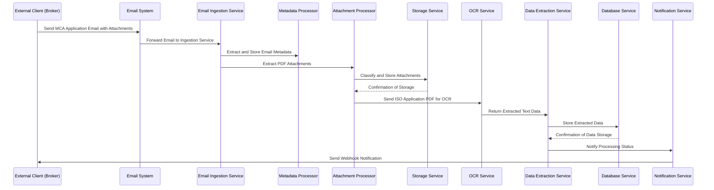

### Sequence 2: Handling OCR Failure during Data Extraction

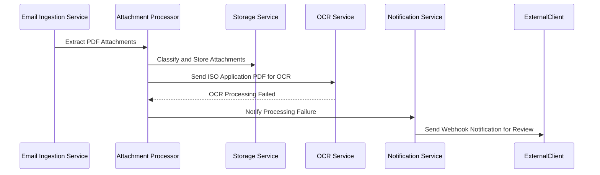

### Sequence 3: Client Managing Webhooks via Web Interface

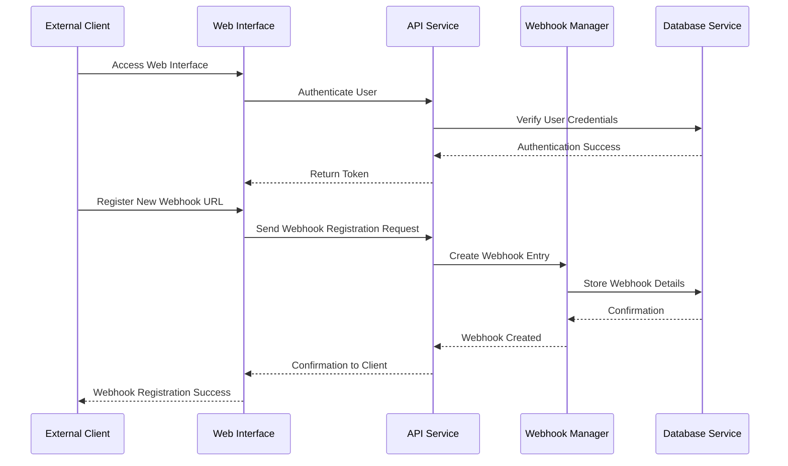

## Data-Flow Diagram

```mermaid
flowchart TD
    A[Broker Sends MCA Application Email] --> B[Email Ingestion Service]
    B --> C[Metadata Processor]
    B --> D[Attachment Processor]
    D --> E[Storage Service (S3/Azure Blob)]
    E --> F[OCR Service]
    F --> G[Data Extraction Service]
    G --> H[Database Service (PostgreSQL)]
    H --> I[API Service]
    I --> J[Web Interface]
    I --> K[Notification Service]
    K --> L[External Clients (Brokers)]
    J --> M[Authentication Service]
    M --> H
    subgraph Error Handling
        F -- OCR Failure --> K
        D -- Classification Failure --> K
    end
    subgraph Monitoring
        N[Monitoring Service] --> B
        N --> D
        N --> F
        N --> G
        N --> H
        N --> I
        N --> J
        N --> K
    end
```

# SYSTEM DESIGN

## PROGRAMMING LANGUAGES

| Platform       | Language        | Justification                                                                                                          |
|----------------|-----------------|------------------------------------------------------------------------------------------------------------------------|
| **Backend**    | TypeScript (Node.js) | Enhances code reliability and maintainability through static typing while leveraging Node.js for its asynchronous and scalable nature, aligning with TR2.1 and TR2.6. |
| **Frontend**   | TypeScript (React.js) | Provides type safety and improved developer experience, facilitating the creation of a responsive and interactive user interface as per TR2.2.          |
| **Infrastructure** | YAML/JSON      | Utilized for Kubernetes configurations and CI/CD pipelines to enable infrastructure as code, ensuring consistency and repeatability.                |
| **Scripting**  | Python/Bash      | Employed for automation tasks, data migration scripts, and tooling integrations, supporting operational efficiency and flexibility.                  |

## DATABASE DESIGN

The system employs PostgreSQL as the primary relational database to manage structured data efficiently. The database design ensures data integrity, supports complex queries, and facilitates relationships between various data entities.

### Tables and Schemas

| Table Name           | Description                                  | Key Fields                                        |
|----------------------|----------------------------------------------|---------------------------------------------------|
| **Emails**           | Stores received email metadata              | `email_id` (PK), `sender`, `subject`, `body`, `received_at`, `status` |
| **Attachments**      | Stores PDF attachments linked to emails      | `attachment_id` (PK), `email_id` (FK), `file_name`, `file_type`, `storage_location`, `uploaded_at` |
| **Applications**     | Stores processing status of applications    | `application_id` (PK), `email_id` (FK), `processing_status`, `processed_at` |
| **Merchant_Details** | Stores merchant-specific information        | `merchant_id` (PK), `application_id` (FK), `business_legal_name`, `dba_name`, `federal_tax_id`, `address`, `industry`, `revenue` |
| **Funding_Details**  | Stores funding request details              | `funding_id` (PK), `application_id` (FK), `funding_requested`, `use_of_funds` |
| **Owner_Information**| Stores owner-specific details               | `owner_id` (PK), `application_id` (FK), `name`, `ssn`, `address`, `date_of_birth`, `ownership_percentage` |
| **Users**            | Stores user account information             | `user_id` (PK), `username`, `email`, `role`, `created_at` |
| **Webhooks**         | Stores webhook configurations per user      | `webhook_id` (PK), `user_id` (FK), `url`, `event_type`, `registered_at` |

### Database Relationships

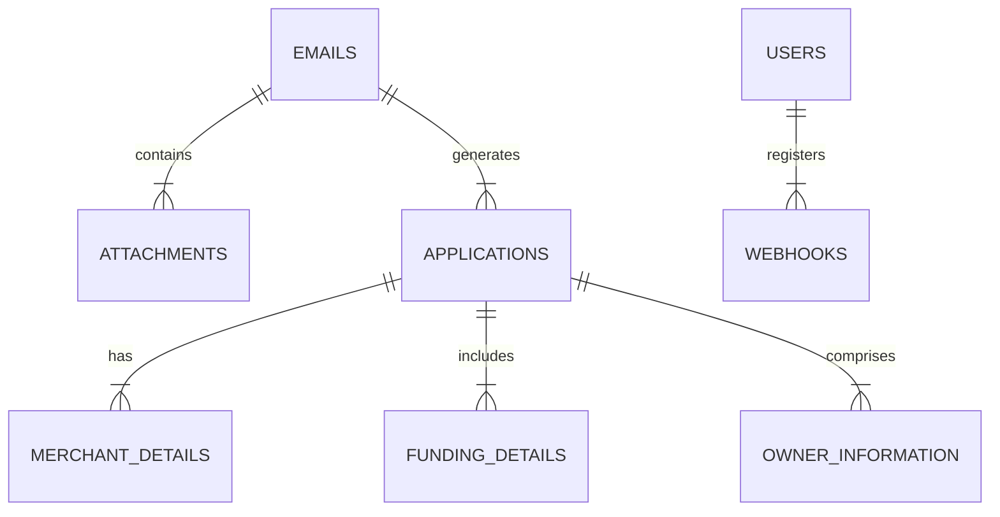

### Data Integrity and Constraints

- **Primary Keys (PK):** Ensure each record is uniquely identifiable.
- **Foreign Keys (FK):** Maintain referential integrity between related tables.
- **Unique Constraints:** Prevent duplicate entries where applicable (e.g., `federal_tax_id` in `Merchant_Details`).
- **Not Null Constraints:** Ensure essential fields are always populated.
- **Indexes:** Implement indexes on frequently queried fields such as `email_id`, `application_id`, and `federal_tax_id` to optimize query performance.

### Database Optimization

- **Normalization:** The database is normalized to the third normal form (3NF) to eliminate data redundancy and ensure data dependency.
- **Partitioning:** Utilize table partitioning for the `Emails` and `Attachments` tables to manage large volumes of data efficiently.
- **Caching:** Implement caching strategies using Redis for frequently accessed data to reduce database load and enhance performance.

## API DESIGN

The system's API is designed following RESTful principles, enabling seamless integration with external clients and internal services. Comprehensive API documentation is provided using Swagger/OpenAPI to ensure clarity and ease of use.

### API Specifications

| Endpoint                        | Method | Description                                              | Authentication  |
|---------------------------------|--------|----------------------------------------------------------|-----------------|
| `/api/auth/login`               | POST   | Authenticate user and issue JWT token                    | None            |
| `/api/webhooks`                 | GET    | Retrieve all webhook configurations for the authenticated user | OAuth 2.0, JWT   |
| `/api/webhooks`                 | POST   | Register a new webhook URL                               | OAuth 2.0, JWT   |
| `/api/webhooks/{id}`            | PUT    | Update an existing webhook configuration                | OAuth 2.0, JWT   |
| `/api/webhooks/{id}`            | DELETE | Remove a webhook configuration                           | OAuth 2.0, JWT   |
| `/api/applications`             | GET    | Retrieve list of processed applications                  | OAuth 2.0, JWT   |
| `/api/applications/{id}`        | GET    | Retrieve details of a specific application               | OAuth 2.0, JWT   |
| `/api/applications/{id}/download` | GET  | Download attachments related to a specific application    | OAuth 2.0, JWT   |
| `/api/reports`                  | GET    | Generate and retrieve processing reports                 | OAuth 2.0, JWT   |
| `/api/users`                    | GET    | Retrieve list of users                                   | OAuth 2.0, JWT   |
| `/api/users/{id}`               | GET    | Retrieve details of a specific user                      | OAuth 2.0, JWT   |
| `/api/users`                    | POST   | Create a new user                                        | OAuth 2.0, JWT   |
| `/api/users/{id}`               | PUT    | Update an existing user                                   | OAuth 2.0, JWT   |
| `/api/users/{id}`               | DELETE | Delete a user                                             | OAuth 2.0, JWT   |

### Authentication and Authorization

All API endpoints require authentication via OAuth 2.0 tokens, leveraging JWT for secure and stateless session management. Role-Based Access Control (RBAC) is enforced to restrict access based on user roles, ensuring that only authorized users can perform specific operations.

#### Authentication Flow

1. **Login:** Users authenticate by sending a POST request to `/api/auth/login` with valid credentials.
2. **Token Issuance:** Upon successful authentication, the system issues a JWT token.
3. **Token Usage:** Clients include the JWT token in the `Authorization` header (`Bearer <token>`) for accessing protected endpoints.
4. **Token Validation:** The API Gateway validates the JWT token and grants access based on the token’s claims and user roles.

### API Endpoint Details

#### `/api/webhooks`

- **GET `/api/webhooks`**
  - **Description:** Retrieve all webhook configurations for the authenticated user.
  - **Parameters:** None
  - **Responses:**
    - `200 OK`: Returns a list of webhook configurations.
    - `401 Unauthorized`: If the user is not authenticated.

- **POST `/api/webhooks`**
  - **Description:** Register a new webhook URL.
  - **Body:**
    ```json
    {
      "url": "https://client.example.com/webhook",
      "event_type": "application_processed"
    }
    ```
  - **Responses:**
    - `201 Created`: Webhook successfully registered.
    - `400 Bad Request`: Invalid input data.
    - `401 Unauthorized`: If the user is not authenticated.

- **PUT `/api/webhooks/{id}`**
  - **Description:** Update an existing webhook configuration.
  - **Parameters:**
    - `id`: Webhook identifier.
  - **Body:**
    ```json
    {
      "url": "https://client.example.com/new-webhook",
      "event_type": "application_failed"
    }
    ```
  - **Responses:**
    - `200 OK`: Webhook successfully updated.
    - `400 Bad Request`: Invalid input data.
    - `401 Unauthorized`: If the user is not authenticated.
    - `404 Not Found`: If the webhook does not exist.

- **DELETE `/api/webhooks/{id}`**
  - **Description:** Remove a webhook configuration.
  - **Parameters:**
    - `id`: Webhook identifier.
  - **Responses:**
    - `204 No Content`: Webhook successfully deleted.
    - `401 Unauthorized`: If the user is not authenticated.
    - `404 Not Found`: If the webhook does not exist.

#### `/api/applications`

- **GET `/api/applications`**
  - **Description:** Retrieve a list of processed applications.
  - **Parameters:**
    - `status` (optional): Filter applications by status (e.g., ready, failed).
    - `page` and `limit` for pagination.
  - **Responses:**
    - `200 OK`: Returns a paginated list of applications.
    - `401 Unauthorized`: If the user is not authenticated.

- **GET `/api/applications/{id}`**
  - **Description:** Retrieve details of a specific application.
  - **Parameters:**
    - `id`: Application identifier.
  - **Responses:**
    - `200 OK`: Returns application details.
    - `401 Unauthorized`: If the user is not authenticated.
    - `404 Not Found`: If the application does not exist.

- **GET `/api/applications/{id}/download`**
  - **Description:** Download attachments related to a specific application.
  - **Parameters:**
    - `id`: Application identifier.
  - **Responses:**
    - `200 OK`: Returns the requested attachments.
    - `401 Unauthorized`: If the user is not authenticated.
    - `404 Not Found`: If the application or attachments do not exist.

#### `/api/reports`

- **GET `/api/reports`**
  - **Description:** Generate and retrieve processing reports.
  - **Parameters:**
    - `type`: Type of report (e.g., daily, weekly, monthly).
    - `format`: Format of the report (e.g., PDF, CSV).
  - **Responses:**
    - `200 OK`: Returns the generated report.
    - `400 Bad Request`: If parameters are invalid.
    - `401 Unauthorized`: If the user is not authenticated.

### API Security

- **OAuth 2.0 and JWT:** All API endpoints are secured using OAuth 2.0 with JWT tokens to ensure that only authenticated and authorized users can access system functionalities.
- **Rate Limiting:** Implemented using API gateways like AWS API Gateway or Kong to prevent abuse and ensure fair usage.
- **Input Validation:** Strict input validation and sanitization are applied to all API requests to prevent injection attacks and ensure data integrity.

### API Documentation

Interactive API documentation is provided using Swagger UI, allowing developers to explore and test API endpoints directly within the documentation interface. The documentation includes:

- **Endpoint Descriptions:** Detailed information about each API endpoint, including purpose and functionality.
- **Request and Response Schemas:** Clearly defined data models for requests and responses, ensuring clients understand the required parameters and data formats.
- **Authentication Details:** Guidelines on how to authenticate API requests using OAuth 2.0 tokens.
- **Example Calls:** Sample requests and responses to assist developers in integrating with the APIs seamlessly.

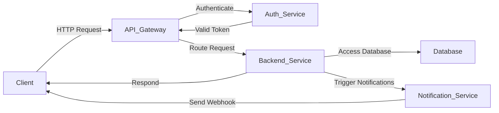

### Example API Request and Response

#### Example: Registering a New Webhook

- **Request:**
  
  ```http
  POST /api/webhooks HTTP/1.1
  Host: api.dollarfunding.com
  Authorization: Bearer <JWT_TOKEN>
  Content-Type: application/json

  {
      "url": "https://client.example.com/webhook",
      "event_type": "application_processed"
  }
  ```

- **Response:**
  
  ```http
  HTTP/1.1 201 Created
  Content-Type: application/json

  {
      "webhook_id": 12345,
      "url": "https://client.example.com/webhook",
      "event_type": "application_processed",
      "registered_at": "2023-10-01T12:34:56Z"
  }
  ```

---

# USER INTERFACE DESIGN

## Overview

The User Interface (UI) is a critical component of the cloud-based solution, providing clients with intuitive and efficient means to interact with the system. The UI is developed using **React.js** to ensure a responsive and interactive experience. It leverages component libraries such as **Material-UI** to maintain consistency and reusability across different UI elements. The design adheres to **WCAG 2.1 Level AA** standards to ensure accessibility for all users.

## Dashboard

### Description

The Dashboard serves as the central hub for users to get an overview of the system's status, recent activities, and key metrics related to MCA application processing. It provides real-time insights through visualizations and summary statistics.

### Layout and Functionality

- **Header:** Contains the company logo, navigation links, and user profile access.
- **Sidebar:** Provides quick access to different sections such as Dashboard, Applications, Webhooks, Reports, and User Management.
- **Main Content Area:**
  - **Summary Cards:** Display key metrics like total applications processed, pending reviews, processing failures, and system health status.
  - **Charts and Graphs:** Visual representations of application processing trends, error rates, and performance metrics.
  - **Recent Activities:** Lists the latest actions performed within the system, such as new applications received or webhook notifications sent.

### Wireframe Mockup

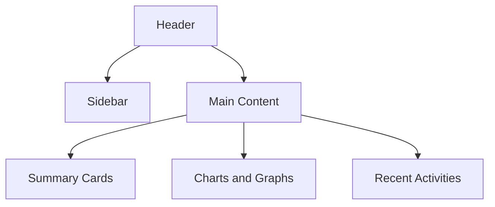

## Application Management

### Description

The Application Management section allows users to view, search, filter, and manage MCA applications. Users can access detailed information about each application, including metadata, extracted data, and attachments.

### Layout and Functionality

- **Search Bar:** Enables users to search applications by various criteria such as application ID, merchant name, or status.
- **Filter Options:** Provides filters based on processing status, date ranges, and other relevant attributes.
- **Application List:** Displays a paginated table of applications with columns for ID, Merchant Name, Submission Date, Status, and Actions.
- **Detail View:** Accessible by clicking on an application, showing comprehensive details, including extracted data and downloadable attachments.
- **Actions:** Options to update the status of an application, initiate data reprocessing, or export application data.

### Wireframe Mockup

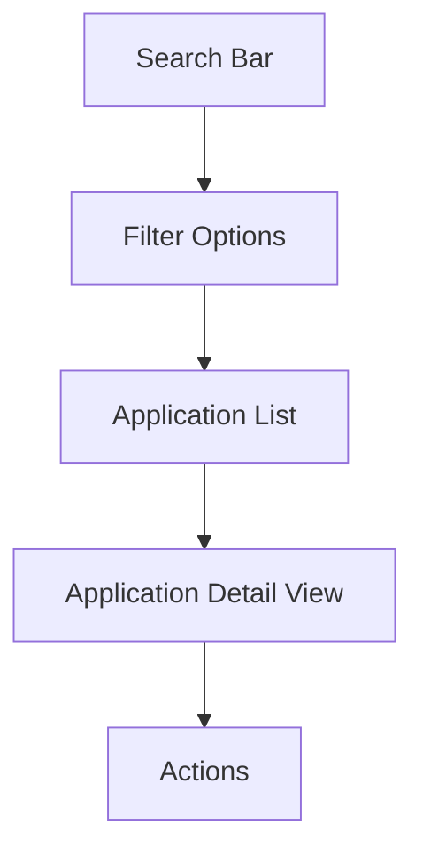

## Webhook Management

### Description

Webhook Management provides clients with the ability to register, update, and delete webhook endpoints for receiving real-time notifications about application processing statuses.

### Layout and Functionality

- **Webhook List:** Displays all registered webhooks with details such as URL, event type, and registration date.
- **Add Webhook Button:** Opens a modal form to register a new webhook by specifying the URL and selecting event types.
- **Edit/Delete Actions:** Allows users to modify or remove existing webhook configurations.
- **Status Indicators:** Shows the status of webhook deliveries, highlighting any failures or pending notifications.

### Wireframe Mockup

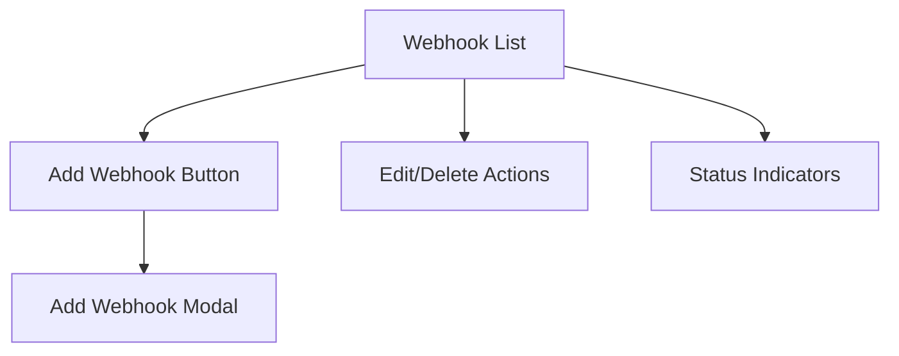

## User Account Management

### Description

User Account Management enables administrators to manage user accounts, roles, and permissions within the system. It ensures that users have appropriate access based on their roles.

### Layout and Functionality

- **User List:** Displays all registered users with details such as username, email, role, and account creation date.
- **Add User Button:** Opens a form to create a new user by entering necessary information and assigning a role.
- **Edit/Delete Actions:** Allows administrators to update user details or remove accounts.
- **Role Assignment:** Interface to assign and modify roles and permissions for each user.
- **Search and Filter:** Tools to search for specific users and filter based on roles or other attributes.

### Wireframe Mockup

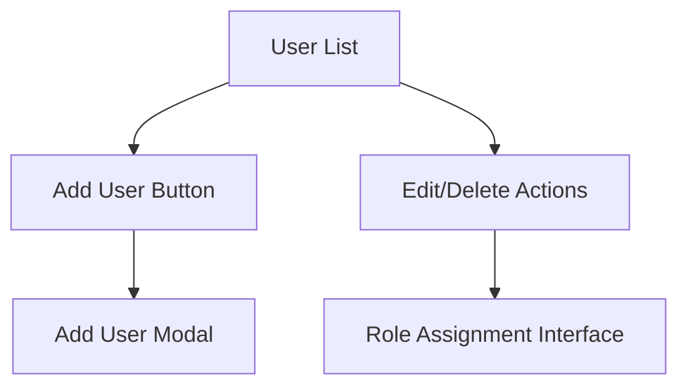

## Report Access

### Description

The Report Access section provides users with the ability to generate, view, and export reports related to application processing. It offers customizable reporting options to cater to different analytical needs.

### Layout and Functionality

- **Report Types:** Dropdown menu to select the type of report (e.g., Daily Processing Summary, Error Rate Analysis).
- **Parameters Selection:** Options to specify report parameters such as date range, filters, and data fields.
- **Generate Report Button:** Initiates the report generation based on selected criteria.
- **Report Viewer:** Displays the generated report within the interface, with options to visualize data through charts and tables.
- **Export Options:** Allows users to export reports in various formats like PDF, CSV, or Excel.
- **Scheduled Reports:** Interface to schedule automated report generation and distribution to stakeholders.

### Wireframe Mockup

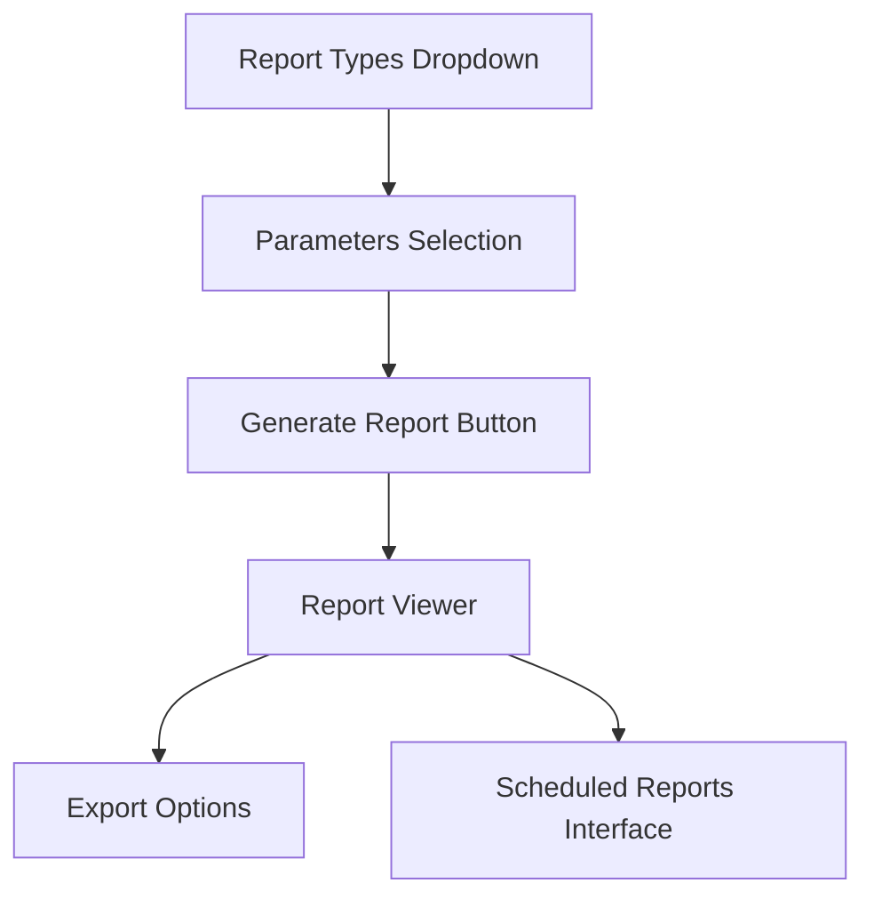

## Accessibility and Responsiveness

### Description

The UI is designed to be accessible and responsive, ensuring a seamless experience across various devices and for users with disabilities. It adheres to **WCAG 2.1 Level AA** standards and employs responsive design techniques to adapt to different screen sizes.

### Layout and Functionality

- **Responsive Design:** Utilizes CSS frameworks like **Material-UI**'s Grid system to ensure components adapt to desktops, tablets, and mobile devices.
- **Accessible Components:** All interactive elements are keyboard navigable, with appropriate ARIA labels and contrast ratios.
- **Dynamic Layouts:** Adjusts the layout dynamically based on the device orientation and screen resolution.
- **Touch-Friendly Interfaces:** Ensures that UI elements are adequately sized and spaced for touch interactions on mobile devices.
- **Accessibility Features:** Includes features like screen reader support, scalable fonts, and alternative text for images.

### Wireframe Mockup

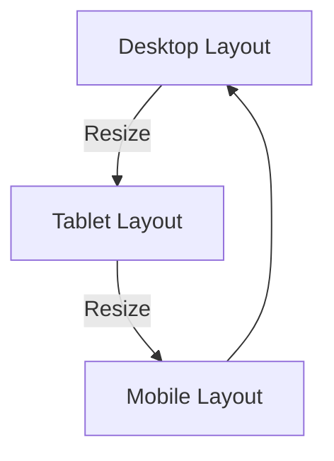

## Consistent UI Components

### Description

To maintain consistency and reusability across the application, the UI employs a standardized set of components. This approach enhances maintainability and provides a cohesive look and feel throughout the platform.

### Layout and Functionality

- **Component Library:** Utilizes **Material-UI** to leverage pre-built, customizable components such as buttons, forms, tables, and dialogs.
- **Theming:** Applies a consistent theme with defined color palettes, typography, and spacing to ensure uniformity.
- **Reusable Components:** Develops reusable components like data tables, form inputs, modal dialogs, and notification banners to streamline development and maintain consistency.
- **Component Documentation:** Maintains comprehensive documentation for all UI components, facilitating ease of use and future enhancements.

### Wireframe Mockup

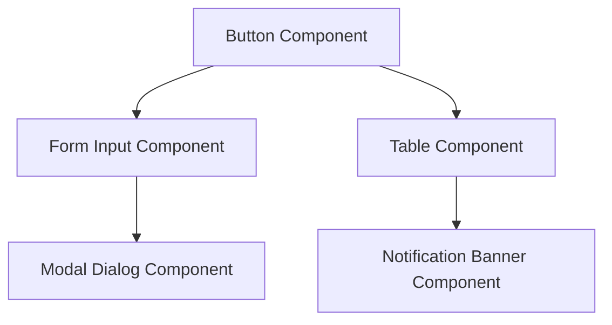

## User Feedback and Support

### Description

The UI incorporates mechanisms for users to provide feedback and seek support directly through the platform. This ensures continuous improvement and addresses user concerns promptly.

### Layout and Functionality

- **Feedback Form:** Accessible from the footer or a dedicated section, allowing users to submit feedback or report issues.
- **Support Chat:** Integrates a live chat feature for real-time assistance, leveraging tools like **Zendesk Chat** or **Intercom**.
- **Help Center:** Provides access to a searchable knowledge base with FAQs, guides, and troubleshooting steps.
- **Issue Tracking:** Enables users to track the status of their reported issues and receive updates on resolutions.

### Wireframe Mockup

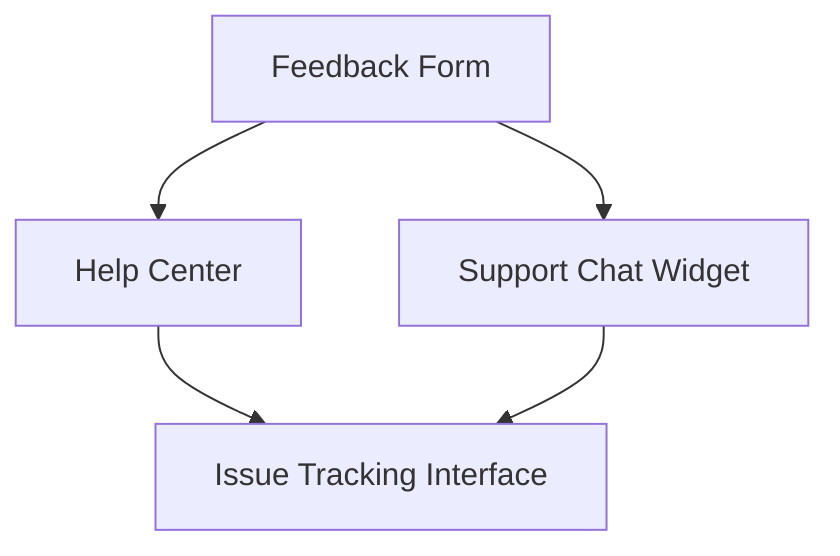

## Localization and Internationalization

### Description

The UI supports multiple languages and regional settings to cater to a diverse client base. It ensures that users from different geographic locations can interact with the platform in their preferred language and format.

### Layout and Functionality

- **Language Selector:** Dropdown menu to select the preferred language for the interface.
- **Localized Content:** Translated UI elements, notifications, and error messages based on the selected language.
- **Regional Settings:** Options to configure date formats, currency, and number formats according to the user's locale.
- **Right-to-Left (RTL) Support:** Ensures that the UI correctly displays languages written from right to left, such as Arabic or Hebrew.

### Wireframe Mockup

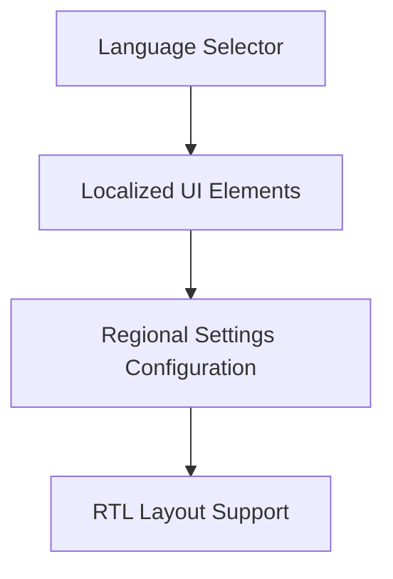

## Security Features in UI

### Description

The UI incorporates essential security features to protect user data and ensure secure interactions. This includes authentication, authorization, and secure data handling practices.

### Layout and Functionality

- **Login and Authentication:** Secure login forms with support for OAuth 2.0 and multi-factor authentication (MFA).
- **Role-Based Access Control:** UI elements adapt based on user roles, restricting access to sensitive sections for unauthorized users.
- **Secure Data Handling:** Ensures that sensitive information is masked or encrypted in the interface, preventing data leaks.
- **Session Management:** Implements session timeout policies and automatic logout after periods of inactivity to enhance security.
- **Audit Trails:** Provides access to user activity logs within the UI for monitoring and compliance purposes.

### Wireframe Mockup

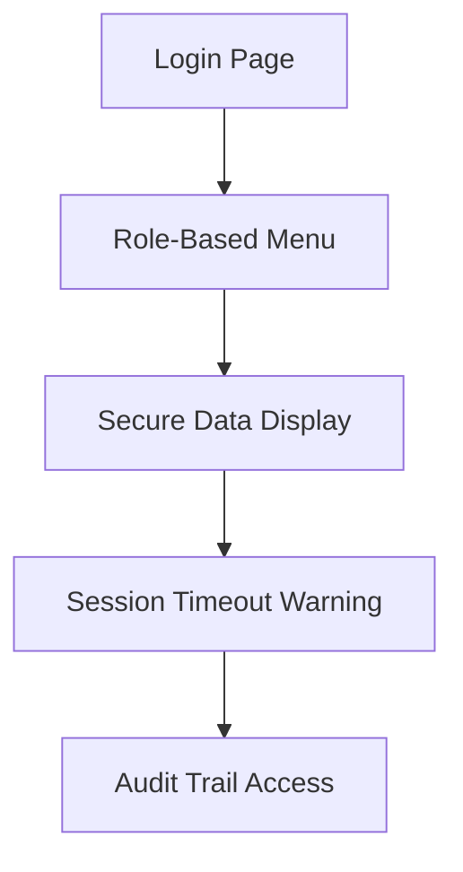

## Conclusion

The **User Interface Design** for the cloud-based MCA application digitization solution is crafted to offer a seamless, secure, and efficient user experience. By leveraging modern technologies like **React.js** and **Material-UI**, the UI ensures responsiveness, accessibility, and consistency across all user-facing components. The design supports robust functionality, enabling clients to manage applications, webhooks, and user accounts with ease while maintaining high standards of security and compliance.

# TECHNOLOGY STACK

## PROGRAMMING LANGUAGES

| Platform          | Language          | Justification                                                                                                     |
|-------------------|-------------------|-------------------------------------------------------------------------------------------------------------------|
| **Backend**       | TypeScript (Node.js) | Provides static typing for enhanced code reliability and maintainability. Node.js offers asynchronous and scalable runtime, ideal for handling concurrent processing of MCA applications as outlined in TR2.1 and TR2.6. |
| **Frontend**      | TypeScript (React.js) | Ensures type safety and improved developer experience. React.js facilitates the creation of a responsive and interactive user interface, supporting the requirements in TR2.2. |
| **Infrastructure**| YAML/JSON         | Utilized for defining Kubernetes configurations and CI/CD pipelines, enabling infrastructure as code for consistency and repeatability. |
| **Scripting**     | Python/Bash       | Employed for automation tasks, data migration scripts, and tooling integrations, enhancing operational efficiency and flexibility. Aligns with TR17.1 and TR29.3. |

## FRAMEWORKS AND LIBRARIES

| Component          | Framework/Library     | Purpose                                                                                                           |
|--------------------|-----------------------|-------------------------------------------------------------------------------------------------------------------|
| **Backend API**    | Express.js            | A minimal and flexible Node.js web application framework for building robust RESTful APIs, supporting TR2.1.      |
| **Frontend UI**    | React.js              | A JavaScript library for building user interfaces, enabling the development of a dynamic and responsive UI as per TR2.2. |
| **UI Components**  | Material-UI           | Provides a set of pre-built, customizable UI components ensuring consistency and reusability across the application, aligning with TR10.6. |
| **State Management**| Redux                 | Manages application state in a predictable way, facilitating efficient data flow within the React-based UI.          |
| **API Documentation**| Swagger/OpenAPI      | Facilitates the creation of comprehensive API documentation and testing interfaces, supporting TR2.4 and TR6.2.   |
| **Form Handling**  | Formik                | Simplifies form management in React, enhancing the development of forms for webhook registration and user inputs.   |
| **Data Visualization** | Chart.js/Recharts  | Enables the creation of interactive charts and graphs for dashboards and reporting features, supporting FR10.3.    |
| **Authentication** | Passport.js/OAuth Libraries | Implements OAuth 2.0 and JWT-based authentication mechanisms, ensuring secure access as outlined in TR2.6 and FR7.1. |
| **Testing**        | Jest, Mocha, Cypress  | Provides frameworks for unit, integration, and end-to-end testing to ensure system reliability and performance as per TR32.1-TR32.7. |
| **State Management**| Redux                 | Manages application state in a predictable way, facilitating efficient data flow within the React-based UI.          |

## DATABASES

| Type                | Database System        | Justification                                                                                                     |
|---------------------|------------------------|-------------------------------------------------------------------------------------------------------------------|
| **Relational**      | PostgreSQL             | Chosen for its robustness, ACID compliance, and ability to handle complex queries and relationships, supporting TR2.3 and FR4.1. |
| **Object Storage**  | AWS S3 / Azure Blob Storage | Provides scalable and secure storage for PDF attachments, ensuring data durability and accessibility as required by TR2.5 and FR2.3. |
| **In-Memory Cache** | Redis                  | Utilized for caching frequently accessed data to reduce database load and improve response times, aligning with TR5.2. |

## THIRD-PARTY SERVICES

| Service Category          | Service Provider            | Description                                                                                                            |
|---------------------------|-----------------------------|------------------------------------------------------------------------------------------------------------------------|
| **Email Services**        | AWS SES / SendGrid           | Handles the reception and sending of emails for MCA application submissions and notifications, supporting FR1.1 and FR27.1. |
| **OCR Services**          | Tesseract OCR / Google Cloud Vision API | Provides advanced OCR capabilities to accurately extract text from ISO applications, including handling handwritten and poorly scanned documents as per FR3.1 and TR31.1. |
| **Authentication Providers** | Auth0 / Okta               | Manages OAuth 2.0 and JWT-based authentication and authorization, ensuring secure user access in line with TR2.6 and FR7.1. |
| **API Management**        | AWS API Gateway / Kong       | Manages and secures API traffic, implements rate limiting, and handles API versioning as required by TR6.1 and TR15.3. |
| **Continuous Integration/Continuous Deployment (CI/CD)** | Jenkins / GitHub Actions / Azure DevOps | Automates the building, testing, and deployment processes, ensuring rapid and reliable software delivery in accordance with TR8.1 and TR14.1. |
| **Monitoring and Logging** | Prometheus, Grafana, ELK Stack / Datadog | Provides real-time monitoring, alerting, and centralized logging to track system performance and security, supporting TR13 and TR31.5. |
| **Notification Services** | AWS SNS / Azure Notification Hubs | Facilitates the sending of webhook notifications to clients regarding application processing statuses, aligning with FR5 and TR27. |
| **Secrets Management**    | AWS Secrets Manager / HashiCorp Vault | Secures API keys, database credentials, and other sensitive information, ensuring compliance with TR4.1 and FR28.6. |
| **Backup Solutions**      | AWS Backup / Azure Backup    | Automates data backups and ensures reliable recovery mechanisms to prevent data loss, supporting TR23 and FR16.3. |
| **Load Balancing**        | AWS ELB / Azure Load Balancer | Distributes incoming traffic evenly across servers to ensure high availability and scalability in line with TR5.1 and TR11.3. |

## SUMMARY

The chosen technology stack leverages modern, scalable, and secure technologies to meet the functional and non-functional requirements of the cloud-based MCA application digitization solution. By utilizing TypeScript with Node.js for the backend and React.js for the frontend, the system ensures high performance and maintainability. PostgreSQL serves as a robust relational database, while AWS S3 or Azure Blob Storage provides secure and scalable object storage for attachments. Integration with third-party services like AWS SES, Tesseract OCR, and AWS API Gateway ensures that the system can handle email processing, OCR capabilities, and API management efficiently. Additionally, the adoption of CI/CD pipelines, comprehensive monitoring tools, and secure authentication providers ensures that the system remains reliable, secure, and maintainable throughout its lifecycle.

# SECURITY CONSIDERATIONS

## AUTHENTICATION AND AUTHORIZATION

The system employs robust authentication and authorization mechanisms to ensure that only authorized users can access and perform actions within the platform. These mechanisms include:

- **Authentication Mechanism:**
  
  - **OAuth 2.0 with JWT Tokens:** All users must authenticate using OAuth 2.0, receiving JSON Web Tokens (JWT) upon successful login. JWT tokens are used for securing API endpoints and maintaining stateless sessions. This aligns with TR28.1 and FR7.1.
  
  - **Multi-Factor Authentication (MFA):** Users are required to provide additional verification (e.g., TOTP via Authy or Google Authenticator) during the authentication process to enhance security, as specified in TR28.3.

- **Authorization Controls:**
  
  - **Role-Based Access Control (RBAC):** User permissions are managed based on their assigned roles, such as Admin, Data Analyst, IT Manager, or Broker. RBAC ensures that users can only access resources and perform actions permitted by their roles, in line with TR30 and FR7.2.
  
  - **Least Privilege Principle:** Users are granted the minimum level of access required to perform their tasks, reducing the risk of unauthorized data exposure or system misuse.

- **Single Sign-On (SSO):**
  
  - **Integration with Identity Providers:** The system supports Single Sign-On (SSO) integrations with identity providers like Okta or Azure AD, streamlining user management and enhancing security through centralized authentication.

### Authentication and Authorization Diagram

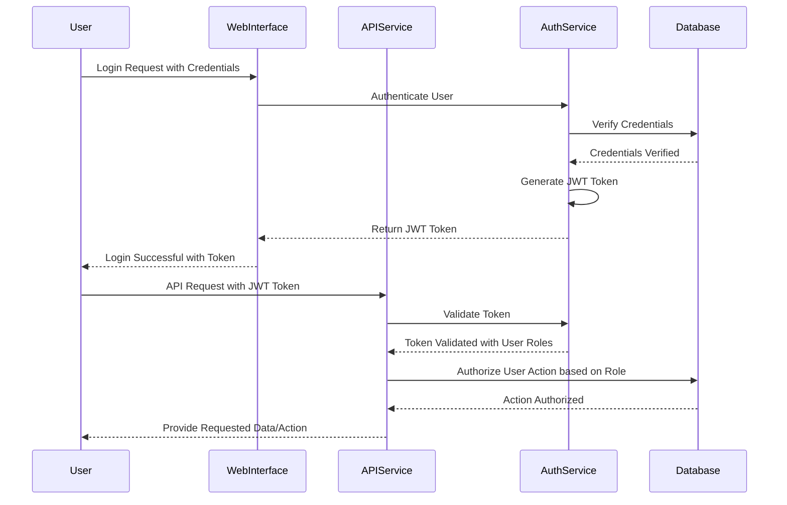

## DATA SECURITY

Protecting sensitive information is paramount to the system's integrity and compliance with data protection regulations. The following measures are implemented to ensure data security:

- **Data Encryption:**
  
  - **At Rest:** All sensitive data stored in databases and object storage (AWS S3 or Azure Blob Storage) is encrypted using AES-256 encryption standards. This ensures that data remains protected even if storage media is compromised, aligning with TR4.1 and FR7.3.
  
  - **In Transit:** Data transmitted between system components, APIs, and clients is secured using TLS 1.2 or higher, preventing interception and tampering. This includes all API interactions and webhook notifications, as specified in TR4.1 and FR7.3.

- **Access Controls:**
  
  - **RBAC Implementation:** Access to data is controlled based on user roles, ensuring that users can only access data pertinent to their responsibilities (TR30.3, FR7.2).
  
  - **Secure API Access:** APIs are protected using API gateways with rate limiting and IP whitelisting (TR6.1, FR15.6), preventing unauthorized access and mitigating abuse.

- **Data Masking and Anonymization:**
  
  - **Non-Production Environments:** Sensitive fields such as SSN and Federal Tax IDs are masked or anonymized to protect privacy and comply with regulations (TR33.1, FR7.4).
  
  - **Data Minimization:** Collect and store only the necessary data required for processing, adhering to data minimization principles under GDPR and CCPA (TR33.4, FR7.4).

- **Secure Data Handling:**
  
  - **Validation and Sanitization:** All input data is validated and sanitized to prevent injection attacks and ensure data integrity (FR15.2).
  
  - **Secrets Management:** Sensitive credentials such as API keys and database passwords are stored securely using tools like AWS Secrets Manager or HashiCorp Vault, restricting access to authorized personnel only (TR2.6, TR15.6).

### Data Security Table

| Data Protection Aspect      | Implementation Details                                                                     | Related Requirements     |
|-----------------------------|--------------------------------------------------------------------------------------------|--------------------------|
| Encryption at Rest          | AES-256 encryption for databases and storage buckets                                       | TR4.1, FR7.3             |
| Encryption in Transit       | TLS 1.2+ for all data transmissions                                                        | TR4.1, FR7.3             |
| Role-Based Access Control   | RBAC to manage permissions based on user roles                                            | TR30.3, FR7.2            |
| Data Masking                | Masking sensitive fields in non-production environments                                   | TR33.1, FR7.4            |
| Data Minimization           | Collect and store only necessary data                                                       | TR33.4, FR7.4            |
| Validation and Sanitization | Input data validation and sanitization to prevent injection attacks                        | FR15.2                   |
| Secrets Management          | Use of AWS Secrets Manager or HashiCorp Vault for storing API keys and database credentials | TR2.6, FR15.6            |

## SECURITY PROTOCOLS

To maintain the system's security posture, the following protocols and procedures are enforced:

- **Authentication Protocols:**
  
  - **OAuth 2.0:** Implement OAuth 2.0 for secure authorization, enabling users to grant access without sharing credentials. This supports obtaining limited access tokens for API interactions (FR7.1).
  
  - **JWT Tokens:** Utilize JSON Web Tokens (JWT) for stateless authentication, ensuring secure and scalable session management (TR28.1, FR28.6).

- **Data Encryption Standards:**
  
  - **AES-256:** Adopt AES-256 encryption for data at rest, ensuring robust protection against unauthorized data access (TR4.1, FR7.3).
  
  - **TLS 1.2+:** Enforce TLS 1.2 or higher for all data in transit, safeguarding against interception and ensuring data integrity during transmission (TR4.1, FR7.3).

- **Intrusion Detection and Prevention:**
  
  - **IDS/IPS Systems:** Deploy Intrusion Detection Systems (IDS) and Intrusion Prevention Systems (IPS) to monitor network traffic and detect/prevent unauthorized access attempts (FR4.4, TR4.4).

- **Security Audits and Penetration Testing:**
  
  - **Regular Audits:** Conduct quarterly security audits and penetration testing to identify and address vulnerabilities (FR7.5, TR7.5).
  
  - **Compliance Audits:** Ensure ongoing compliance with GDPR, CCPA, and other relevant regulations through systematic reviews and assessments (FR7.4, TR7.6).

- **API Security Protocols:**
  
  - **Rate Limiting:** Implement rate limiting on API endpoints to prevent abuse and Denial-of-Service (DoS) attacks (TR15.3, FR15.3).
  
  - **Input Validation:** Enforce strict input validation rules on all API requests to guard against injection attacks and ensure data integrity (FR15.2, FR7.4).

- **Secure Development Practices:**
  
  - **Code Reviews:** Mandate regular code reviews and security testing during the development lifecycle to prevent vulnerabilities (TR32.7).
  
  - **Dependency Management:** Use automated license scanning tools and ensure third-party libraries comply with security standards (TR25, TR31).
  
  - **Environment Security:** Maintain secure configurations for all environments, leveraging Infrastructure as Code (IaC) practices to enforce consistency and reduce misconfigurations (TR17.1).

- **Incident Response Protocols:**
  
  - **Incident Management Plan:** Develop and implement an incident response plan to swiftly address and mitigate security incidents (TR8.5).
  
  - **Automated Notifications:** Configure alerting mechanisms to notify the operations team of critical security events in real-time (FR9.3, TR13.3).

### Security Protocols Diagram

```mermaid
flowchart TB
    A[User Authentication] --> B[OAuth 2.0]
    B --> C[Issue JWT Token]
    C --> D[Access API with JWT]
    D --> E{Authorize Action}
    E --> |Allowed| F[Perform Action]
    E --> |Denied| G[Reject Request]
    F --> H[Log Action]
    G --> H
    H --> I[Monitor Logs with IDS/IPS]
  
    subgraph Security Measures
        J[Data Encryption (AES-256, TLS 1.2+)]
        K[Role-Based Access Control (RBAC)]
        L[Intrusion Detection and Prevention (IDS/IPS)]
        M[Regular Security Audits and Penetration Testing]
    end
    
    A --> J
    D --> K
    I --> L
    L --> M
```

### Security Best Practices

- **Regular Updates and Patching:** Ensure all system components, libraries, and dependencies are kept up-to-date with the latest security patches.
  
- **Secure Configurations:** Apply security best practices for all software and hardware configurations, minimizing exposure to potential threats.
  
- **Employee Training:** Conduct regular security training for all team members to raise awareness about security best practices and emerging threats.
  
- **Access Logging:** Maintain detailed logs of all access to sensitive data and system resources to facilitate audits and forensic analysis.

---

# INFRASTRUCTURE

## Deployment Environment

The system is designed to be deployed in a **cloud-based environment** to leverage scalability, flexibility, and high availability. The primary deployment environment is hosted on **Amazon Web Services (AWS)**, ensuring robust performance and integration with various AWS services. Additionally, a **multi-region deployment** strategy is employed to enhance fault tolerance and reduce latency for geographically dispersed clients.

## Cloud Services

| Service Category             | AWS Service                | Justification                                                                                              |
|------------------------------|----------------------------|------------------------------------------------------------------------------------------------------------|
| **Compute**                  | Amazon EC2                 | Provides scalable virtual servers for running application services, ensuring high availability and flexibility. |
| **Storage**                  | Amazon S3                  | Offers durable and scalable object storage for PDF attachments, enabling secure and efficient data retrieval. |
| **Email Services**           | Amazon SES                 | Facilitates reliable and scalable email ingestion and outbound email notifications for MCA applications.     |
| **OCR Processing**           | Amazon Textract            | Delivers advanced OCR capabilities, supporting the extraction of text from diverse and imperfect documents.  |
| **Database**                 | Amazon RDS (PostgreSQL)    | Managed relational database service ensuring high availability, automated backups, and scalability.         |
| **Container Registry**       | Amazon ECR                 | Provides a secure and scalable container registry for storing Docker images used in the system.             |
| **Load Balancing**           | Amazon ELB (Elastic Load Balancer) | Distributes incoming traffic across multiple instances, ensuring optimal resource utilization and fault tolerance. |
| **Monitoring and Logging**   | Amazon CloudWatch          | Enables real-time monitoring, logging, and alerting for all system components, ensuring proactive issue resolution. |
| **Secrets Management**       | AWS Secrets Manager        | Secures and manages sensitive information such as API keys, database credentials, and access tokens.        |
| **Content Delivery**         | Amazon CloudFront          | Provides a global content delivery network (CDN) to reduce latency and improve access speed for clients.     |
| **Security and Compliance**  | AWS IAM, AWS Shield        | Implements robust identity and access management, along with DDoS protection to safeguard system integrity.  |

## Containerization

The system utilizes **Docker** for containerization, ensuring consistency across development, testing, and production environments. Docker containers encapsulate application dependencies, configurations, and services, enabling seamless deployment and scalability.

### Container Specifications

| Container Component          | Description                                                  |
|------------------------------|--------------------------------------------------------------|
| **Backend Services**         | Encapsulates Node.js applications handling business logic and API endpoints. |
| **Frontend Services**        | Contains React.js applications serving the user interface.   |
| **Database Services**        | Hosts PostgreSQL instances with necessary configurations for data storage. |
| **OCR Services**             | Runs OCR processing tools like Amazon Textract or integrated third-party OCR APIs. |
| **Utility Containers**       | Includes services for background tasks, monitoring agents, and logging collectors. |

## Orchestration

**Kubernetes** is employed as the container orchestration tool to manage Docker containers at scale. Kubernetes facilitates automated deployment, scaling, and management of containerized applications, ensuring high availability and efficient resource utilization.

### Kubernetes Architecture

```mermaid
graph LR
    A[Developer Machine] --> B[CI/CD Pipeline]
    B --> C[Amazon EKS Cluster]
    C --> D[Pods]
    D --> E[Containers]
    C --> F[Services]
    F --> G[Amazon ELB]
    F --> H[Amazon RDS]
    F --> I[Amazon S3]
    F --> J[Amazon CloudWatch]
```

### Kubernetes Features

- **Automated Scaling:** Dynamically scales application instances based on load and performance metrics.
- **Self-Healing:** Automatically replaces failed containers to maintain service continuity.
- **Service Discovery:** Facilitates seamless communication between microservices through internal DNS and service proxies.
- **Rolling Updates:** Enables zero-downtime deployments by gradually updating services without disrupting active users.
- **Resource Management:** Allocates and optimizes CPU and memory resources across containers to ensure efficient utilization.

## CI/CD Pipeline

The Continuous Integration and Continuous Deployment (CI/CD) pipeline automates the building, testing, and deployment processes, ensuring rapid and reliable software delivery. The pipeline leverages **GitHub Actions** for automation, integrating with AWS services for deployment and monitoring.

### CI/CD Workflow

```mermaid
graph TB
    A[Code Commit] --> B[Run Unit Tests]
    B --> C{Tests Passed?}
    C -->|Yes| D[Build Docker Images]
    C -->|No| E[Notify Developer]
    D --> F[Push to Amazon ECR]
    F --> G[Deploy to Kubernetes Cluster]
    G --> H[Run Integration Tests]
    H --> I{Tests Passed?}
    I -->|Yes| J[Deploy to Production]
    I -->|No| K[Rollback Deployment]
    J --> L[Notify Stakeholders]
    K --> E
```

### CI/CD Components

| Stage                   | Tools and Services                  | Description                                                                                               |
|-------------------------|-------------------------------------|-----------------------------------------------------------------------------------------------------------|
| **Source Control**      | GitHub                              | Hosts the code repository, facilitating version control and collaborative development.                   |
| **Build Automation**    | GitHub Actions                      | Automates the building of Docker images and ensures that code changes are correctly packaged.             |
| **Testing**             | Jest, Cypress                       | Executes automated unit, integration, and end-to-end tests to validate code functionality and performance.|
| **Container Registry**  | Amazon ECR                          | Stores Docker images securely, enabling easy access for deployment to Kubernetes clusters.                |
| **Deployment**          | GitHub Actions, kubectl              | Automates the deployment of Docker containers to the Kubernetes cluster, ensuring consistent rollout.     |
| **Monitoring and Alerts** | Amazon CloudWatch, Prometheus      | Continuously monitors system performance and triggers alerts for any anomalies or failures detected.       |
| **Rollback Mechanism**  | Kubernetes Rollouts                 | Facilitates automatic rollback to previous stable versions in case of deployment failures or test failures.|

### CI/CD Best Practices

- **Automated Testing:** Ensures that all code changes are thoroughly tested before deployment, reducing the risk of introducing bugs.
- **Version Control Integration:** Maintains traceability of changes, enabling easy rollback and auditability.
- **Continuous Deployment:** Accelerates the release of new features and improvements by automating the deployment process.
- **Security Integration:** Incorporates security checks and compliance validations within the CI/CD pipeline to maintain system integrity.
- **Parallel Processing:** Utilizes parallel job execution to speed up the pipeline, enhancing overall efficiency.

---

```markdown
# APPENDICES

## SECTION_TITLE

*Any additional technical information mentioned in any of the inputs but not captured so far in this document.*

---

## GLOSSARY

| Term                     | Definition                                                                                      |
|--------------------------|-------------------------------------------------------------------------------------------------|
| MCA                      | Merchant Cash Advance, a type of financing provided to businesses based on future credit card sales. |
| OCR                      | Optical Character Recognition, technology used to convert different types of documents into editable and searchable data. |
| API                      | Application Programming Interface, a set of rules that allows different software entities to communicate with each other. |
| UI                       | User Interface, the means by which the user interacts with the system.                           |
| Webhook                  | A method for one application to provide real-time information to other applications.             |
| ISO Application          | A standardized application form used for processing MCA requests.                               |
| GDPR                     | General Data Protection Regulation, a regulation in EU law on data protection and privacy.      |
| CCPA                     | California Consumer Privacy Act, a state statute intended to enhance privacy rights and consumer protection for residents of California, USA. |
| AES-256                  | Advanced Encryption Standard with a 256-bit key, a widely used encryption algorithm.             |
| TLS                      | Transport Layer Security, a cryptographic protocol designed to provide secure communication over a computer network. |
| IMAP                     | Internet Message Access Protocol, a standard email protocol that stores email messages on a mail server. |
| AWS S3                   | Amazon Web Services Simple Storage Service, a scalable storage solution provided by AWS.         |
| Azure Blob Storage       | Microsoft's Object Storage solution for the cloud, offering storage for large amounts of unstructured data. |
| OAuth 2.0                | An open standard for access delegation, commonly used for token-based authentication and authorization on the internet. |
| RBAC                     | Role-Based Access Control, a method of regulating access to computer or network resources based on the roles of individual users. |
| IDS/IPS                  | Intrusion Detection System/Intrusion Prevention System, technologies used to detect and prevent unauthorized access to networks. |
| SOC 2 Type II            | Service Organization Control 2 Type II, an auditing procedure that ensures service providers securely manage data to protect the interests of the organization and its customers. |
| PCI-DSS                  | Payment Card Industry Data Security Standard, a set of security standards designed to ensure that all companies that accept, process, store or transmit credit card information maintain a secure environment. |
| WCAG                     | Web Content Accessibility Guidelines, a set of guidelines for making web content more accessible to people with disabilities. |
| MTBF                     | Mean Time Between Failures, a measure of how reliable a hardware product or component is.        |

## ACRONYMS

| Acronym | Expanded Form                        |
|---------|---------------------------------------|
| MCA     | Merchant Cash Advance                 |
| OCR     | Optical Character Recognition         |
| API     | Application Programming Interface     |
| UI      | User Interface                        |
| GDPR    | General Data Protection Regulation    |
| CCPA    | California Consumer Privacy Act       |
| AES     | Advanced Encryption Standard          |
| TLS     | Transport Layer Security              |
| IMAP    | Internet Message Access Protocol      |
| AWS     | Amazon Web Services                   |
| RBAC    | Role-Based Access Control             |
| IDS     | Intrusion Detection System            |
| IPS     | Intrusion Prevention System           |
| SOC     | Service Organization Control          |
| PCI-DSS | Payment Card Industry Data Security Standard |
| WCAG    | Web Content Accessibility Guidelines  |
| MTBF    | Mean Time Between Failures            |

## ADDITIONAL REFERENCES

- **General Data Protection Regulation (GDPR):** [https://gdpr.eu/](https://gdpr.eu/)
- **California Consumer Privacy Act (CCPA):** [https://oag.ca.gov/privacy/ccpa](https://oag.ca.gov/privacy/ccpa)
- **ISO/IEC 27001 Information Security Management:** [https://www.iso.org/isoiec-27001-information-security.html](https://www.iso.org/isoiec-27001-information-security.html)
- **National Institute of Standards and Technology (NIST) Guidelines:** [https://www.nist.gov/](https://www.nist.gov/)
- **Payment Card Industry Data Security Standard (PCI-DSS):** [https://www.pcisecuritystandards.org/](https://www.pcisecuritystandards.org/)
- **Web Content Accessibility Guidelines (WCAG) 2.1:** [https://www.w3.org/TR/WCAG21/](https://www.w3.org/TR/WCAG21/)
- **OAuth 2.0 Specifications:** [https://oauth.net/2/](https://oauth.net/2/)
- **Amazon Web Services (AWS) S3 Documentation:** [https://docs.aws.amazon.com/s3/](https://docs.aws.amazon.com/s3/)
- **Azure Blob Storage Documentation:** [https://docs.microsoft.com/en-us/azure/storage/blobs/](https://docs.microsoft.com/en-us/azure/storage/blobs/)
- **Intrusion Detection System (IDS) Overview:** [https://www.cisco.com/c/en/us/products/security/intrusion-detection-system-ids/index.html](https://www.cisco.com/c/en/us/products/security/intrusion-detection-system-ids/index.html)
- **OAuth 2.0 and OpenID Connect:** [https://openid.net/connect/](https://openid.net/connect/)
```